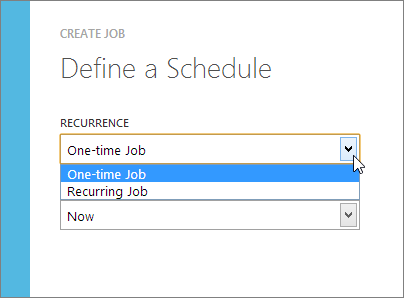
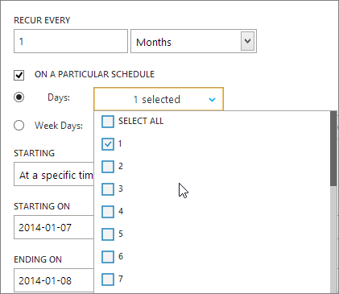
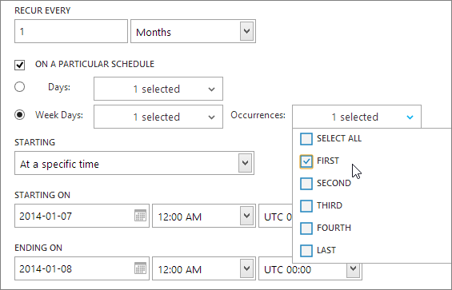
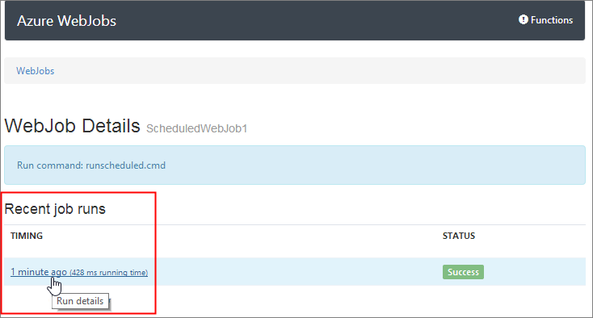
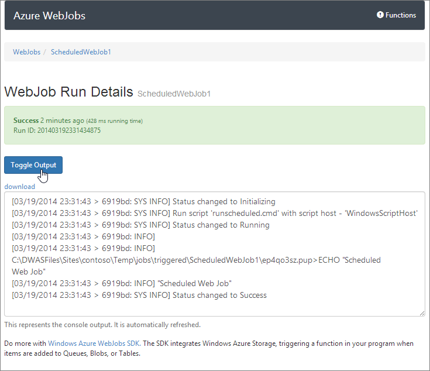

<properties  linkid="web-sites-create-web-jobs" urlDisplayName="How to create web jobs in Microsoft Azure" pageTitle="How to Create Web Jobs in Microsoft Azure Web Sites" metaKeywords="Microsoft Azure Web Sites, Web Jobs" description="Learn how to create web jobs in Microsoft Azure Web Sites." metaCanonical="" services="web-sites" documentationCenter="" title="How to Create Web Jobs in Microsoft Azure Web Sites" authors="timamm" solutions="" writer="timamm" manager="paulettm" editor="mollybos" />

# Come utilizzare la funzionalità WebJobs in Siti Web di Microsoft Azure

Siti Web di Microsoft Azure consente di eseguire programmi o script nel sito Web in tre modi: su richiesta, in modo continuo o in base a una pianificazione. Non sono previsti costi aggiuntivi per l'utilizzo di Microsoft Azure WebJobs a meno che non si desideri abilitare la funzionalità AlwaysOn descritta più avanti in questo articolo.

## Sommario

* [Tipi di file consentiti per gli script](#acceptablefiles)
* [Creare un'attività su richiesta](#CreateOnDemand)
* [Creare un'attività con esecuzione continua](#CreateContinuous)
* [Creare un'attività pianificata](#CreateScheduled)
  * [Processi pianificati e Utilità di pianificazione di Azure](#Scheduler)
* [Visualizzare la cronologia processo](#ViewJobHistory)
* [Note](#WHPNotes)
* [Passaggi successivi](#NextSteps)
  * [Maggiore produttività Microsoft Azure WebJobs SDK](#WebJobsSDK)
  * [Metodi di distribuzione alternativi](#AlternateDeployments)
  * [Risorse aggiuntive](#AdditionalResources)

## Tipi di file
consentiti per gli script## I tipi di file seguenti sono accettati come script eseguibili:

.cmd, .bat, .exe (Prompt dei comandi di Windows)

.ps1 (PowerShell)

.sh (Bash)

.php (PHP)

.py (Python)

.js (Node)

## Creare un'attività su richiesta

1.  Nella barra dei comandi della pagina **WebJobs** fare clic su **Add**. Verrà visualizzata la finestra di dialogo **New Job**.
    
    

2.  In **Name** specificare un nome per l'attività. Il nome deve iniziare con una lettera o un numero e non può contenere caratteri speciali diversi da "-" e "_".

3.  Nella casella **Content (Zip Files - 100MB Max)** passare al file ZIP contenente lo script. Il file ZIP deve contenere il file eseguibile (con estensione .exe, .cmd, .bat, .sh, .php, .py, .js) e gli eventuali file di supporto necessari per eseguire il programma o lo script.

4.  Nella casella **How to Run** selezionare **Run on Demand**.

5.  Selezionare il segno di spunta nella parte inferiore della finestra di dialogo per caricare lo script nel sito Web. Il nome specificato per l'attività verrà visualizzato nell'elenco:
    
    

6.  Per eseguire lo script, selezionare il nome corrispondente nell'elenco e fare clic su **Run Once** nella barra dei comandi nella parte inferiore della pagina del portale.
    
    

## Creare un'attività con esecuzione continua

1.  Per creare un'attività eseguita in modo continuo, attenersi alla stessa procedura utilizzata per creare un'attività eseguita una volta sola e nella casella **How to Run** selezionare **Run continuously**.
    
    

2.  Per avviare o arrestare un'attività con esecuzione continua, selezionare l'attività nell'elenco e fare clic su **Start** o **Stop** nella barra dei comandi.

> [WACOM.NOTE] Se il sito Web è in esecuzione su più di un'istanza, l'attività con esecuzione continua verrà eseguita su tutte le istanze. Le attività su richiesta e pianificate vengono eseguite su una singola istanza selezionata per il bilanciamento del carico da Microsoft Azure.

> [WACOM.NOTE]
> Per le attività con esecuzione continua, è consigliabile abilitare l'opzione **Always On** nella pagina Configure per il sito Web. La funzionalità AlwaysOn, disponibile in modalità Basic e Standard, evita che i siti Web vengano scaricati anche se sono rimasti inattivi per qualche tempo. Se il sito Web in uso è sempre caricato, l'attività con esecuzione continua potrebbe essere eseguita con maggiore affidabilità.

## Creare un'attività pianificata

1. Per creare un'attività pianificata, attenersi alla stessa procedura seguita in precedenza e nella casella **How to Run** scegliere **Run on a schedule**.

	![New Scheduled Job][NewScheduledJob]

2.  Scegliere una voce in **Scheduler Region** per il processo e quindi    fare clic sulla freccia nella parte inferiore destra della finestra di dialogo per passare alla schermata successiva.

3.  Nella finestra di dialogo **Create Job** scegliere il tipo di ricorrenza desiderata in **Recurrence**: **One-time job** o **Recurring job**.
    
    

4.  Scegliere inoltre un'ora di inizio in **Starting**: **Now** o **At a specific time**.
    
    

5.  Se si desidera che la pianificazione venga avviata a un'ora specifica, scegliere i valori dell'ora di inizio in **Starting On**.
    
    

6.  Se si sceglie un processo ricorrente, è disponibile l'opzione **Recur Every** per specificare la frequenza di ricorrenza e l'opzione **Ending On** per specificare un'ora di fine.
    
    

7.  Se si sceglie **Weeks**, è possibile selezionare la casella **On a Particular Schedule** e specificare i giorni della settimana in cui verrà eseguito il processo.
    
    

8.  Se si sceglie **Months** e si seleziona la casella **On a Particular Schedule** è possibile impostare l'esecuzione del processo in determinati giorni del mese in **Days**.
    
    

9.  Se si sceglie **Week Days**, è possibile selezionare il giorno o i giorni della settimana del mese nei quali deve essere eseguito il processo.
    
    

10.  Infine, è possibile utilizzare l'opzione **Occurrences** per scegliere la settimana del mese (prima, seconda, terza e così via) in cui deve essere eseguito il processo nei giorni della settimana specificati.
    
    

11. Dopo avere creato uno o più processi, i relativi nomi verranno visualizzati nella scheda WebJobs insieme a stato, tipo di pianificazione e altre informazioni. Vengono mantenute le informazioni cronologiche delle ultime 30 attività.
    
    

### I processi pianificati e i processi pianificati dell'Utilità di pianificazione di 
Azure possono essere ulteriormente configurati nel portale dell'Utilità di pianificazione di Azure.

1.  Nella pagina WebJobs fare clic sul collegamento **schedule** del processo per passare alla pagina del portale dell'Utilità di pianificazione di Azure.
    
    

2.  Nella pagina Scheduler fare clic sul processo.
    
    

3.  Verrà visualizzata la pagina **Job Action** in cui è possibile configurare ulteriormente il processo.
    
    

<!-- ================ ViewJobHistory ================= -->

## Visualizzare la cronologia processo
1. Per visualizzare la cronologia di esecuzione di un processo, inclusi i processi creati con WebJobs SDK, fare clic sul collegamento corrispondente nella colonna **Logs**. È possibile utilizzare l'icona degli Appunti per copiare l'URL della pagina del file di log negli Appunti, se lo si desidera.

	![Logs Link][WebJobLogs]

1.  Se si fa clic sul collegamento viene visualizzata la pagina dei dettagli dei processi Web per l'attività. In questa pagina è indicato il nome del comando eseguito, le ore delle ultime esecuzioni e il relativo esito positivo o negativo. In **Recent job runs** fare clic su un'ora per visualizzare ulteriori dettagli.
    
    

2.  Verrà visualizzata la pagina **WebJob Run Details**. Fare clic su **Toggle Output** per visualizzare il testo dei contenuti del log. Il log di output è in formato testo.
    
    

3.  Per visualizzare il testo dell'output in un'altra finestra del browser, fare clic sul collegamento **download**. Per scaricare il testo stesso, fare clic con il pulsante destro del mouse sul collegamento e utilizzare le opzioni del browser in uso per salvare il contenuto del file.
    
    

4.  Il collegamento **WebJobs** nella parte superiore della pagina offre un modo pratico per ottenere un elenco di processi Web nel dashboard della cronologia.
    
    
    
    
    
    Quando si fa clic su questi collegamenti, si viene reindirizzati alla pagina WebJob Details per il processo selezionato.

## Note

* A partire da marzo 2014, i siti Web in modalità gratuita possono scadere dopo 20 minuti se non vengono inviate richieste al sito scm (distribuzione) e se il portale del sito Web non è aperto in Azure. Le richieste al sito effettivo non comportano la reimpostazione del timeout.

* Il codice per un processo continuo deve essere scritto per l'esecuzione in un ciclo infinito.

* I processi continui vengono eseguiti in modo continuo solo quando il sito è attivo.

* Le modalità Basic e Standard offrono la funzionalità AlwaysOn che, se abilitata, impedisce ai siti di diventare inattivi.

## Passaggi successivi

### Maggiore produttività con Microsoft Azure WebJobs SDK
Microsoft Azure WebJobs SDK semplifica l'aggiunta di elaborazione in background per i siti Web di Microsoft Azure. L'SDK integra il servizio di archiviazione di Microsoft Azure, attivando una funzione nel programma quando vengono aggiunti elementi a code, BLOB e tabelle. Il dashboard, ora integrato nel portale di Azure, offre funzionalità di monitoraggio e diagnostica avanzate per i programmi scritti mediante l'SDK. Le funzionalità di monitoraggio e diagnostica sono incorporate nell'SDK e non richiedono l'aggiunta di codice speciale nel programma da parte dell'utente.

Per ulteriori informazioni, vedere [Introduzione a Microsoft Azure WebJobs SDK][1]. In questa esercitazione vengono fornite informazioni generali sulle funzionalità disponibili nell'SDK WebJobs e vengono illustrate le procedure per creare ed eseguire un semplice processo in background Hello World.

Per visualizzare la procedura dettagliata di un'app della riga di comando di esempio creata con Microsoft Azure WebJobs SDK, vedere [Introduzione a Microsoft Azure WebJobs][2].

### Metodi di distribuzione alternativi
Se non si desidera utilizzare la pagina del portale WebJobs per caricare gli script, è possibile utilizzare un FTP, GIT o Web Deploy. Per ulteriori informazioni, vedere [Come distribuire Microsoft Azure WebJobs][3] e l'articolo di blog relativo alla [distribuzione GIT di un'app console .NET in Azure utilizzando WebJobs][4].

### Risorse aggiuntive 
- Per un elenco commentato di collegamenti relativi alla funzionalità WebJobs, vedere [Utilizzo della funzionalità WebJobs di Siti Web di Azure][5].

* Video relativi a WebJobs:
  
  [Azure WebJobs 101 - WebJob di base con Jamie Espinosa][6]
  
  [Azure WebJobs 102 - WebJob pianificati e dashboard WebJobs con Jamie Espinosa][7]
  
  [Utilità di pianificazione di Azure 101 - Kevin Lam spiega come pianificare attività][8]

<!-- LINKS -->
[PSonWebJobs]:http://blogs.msdn.com/b/nicktrog/archive/2014/01/22/running-powershell-web-jobs-on-azure-websites.aspx

[HanselIntro]:http://www.hanselman.com/blog/IntroducingWindowsAzureWebJobs.aspx

[AmitDeploy]:http://blog.amitapple.com/post/74215124623/deploy-azure-webjobs

[AmitConsole]:http://blog.amitapple.com/post/73574681678/git-deploy-console-app

[RickWebJobsCurah]:http://go.microsoft.com/fwlink/?LinkId=390226

<!-- IMAGES -->
[1]: http://asp.net/aspnet/overview/developing-apps-with-windows-azure/getting-started-with-windows-azure-webjobs
[2]: http://www.hanselman.com/blog/IntroducingWindowsAzureWebJobs.aspx
[3]: http://blog.amitapple.com/post/74215124623/deploy-azure-webjobs
[4]: http://blog.amitapple.com/post/73574681678/git-deploy-console-app
[5]: http://go.microsoft.com/fwlink/?LinkId=390226
[6]: http://www.windowsazure.com/it-it/documentation/videos/azure-webjobs-basics/
[7]: http://www.windowsazure.com/it-it/documentation/videos/azure-webjobs-schedule-and-dashboard/
[8]: http://www.windowsazure.com/it-it/documentation/videos/azure-scheduler-how-to/

[OnDemandWebJob]: ./media/web-sites-create-web-jobs/01aOnDemandWebJob.png
[WebJobsList]: ./media/web-sites-create-web-jobs/02aWebJobsList.png
[NewContinuousJob]: ./media/web-sites-create-web-jobs/03aNewContinuousJob.png
[NewScheduledJob]: ./media/web-sites-create-web-jobs/04aNewScheduledJob.png
[SchdRecurrence]: ./media/web-sites-create-web-jobs/05SchdRecurrence.png
[SchdStart]: ./media/web-sites-create-web-jobs/06SchdStart.png
[SchdStartOn]: ./media/web-sites-create-web-jobs/07SchdStartOn.png
[SchdRecurEvery]: ./media/web-sites-create-web-jobs/08SchdRecurEvery.png
[SchdWeeksOnParticular]: ./media/web-sites-create-web-jobs/09SchdWeeksOnParticular.png
[SchdMonthsOnPartDays]: ./media/web-sites-create-web-jobs/10SchdMonthsOnPartDays.png
[SchdMonthsOnPartWeekDays]: ./media/web-sites-create-web-jobs/11SchdMonthsOnPartWeekDays.png
[SchdMonthsOnPartWeekDaysOccurences]: ./media/web-sites-create-web-jobs/12SchdMonthsOnPartWeekDaysOccurences.png
[RunOnce]: ./media/web-sites-create-web-jobs/13RunOnce.png
[WebJobsListWithSeveralJobs]: ./media/web-sites-create-web-jobs/13WebJobsListWithSeveralJobs.png
[WebJobLogs]: ./media/web-sites-create-web-jobs/14WebJobLogs.png
[WebJobDetails]: ./media/web-sites-create-web-jobs/15WebJobDetails.png
[WebJobRunDetails]: ./media/web-sites-create-web-jobs/16WebJobRunDetails.png
[DownloadLogOutput]: ./media/web-sites-create-web-jobs/17DownloadLogOutput.png
[WebJobsLinkToDashboardList]: ./media/web-sites-create-web-jobs/18WebJobsLinkToDashboardList.png
[WebJobsListInJobsDashboard]: ./media/web-sites-create-web-jobs/19WebJobsListInJobsDashboard.png
[LinkToScheduler]: ./media/web-sites-create-web-jobs/31LinkToScheduler.png
[SchedulerPortal]: ./media/web-sites-create-web-jobs/32SchedulerPortal.png
[JobActionPageInScheduler]: ./media/web-sites-create-web-jobs/33JobActionPageInScheduler.png