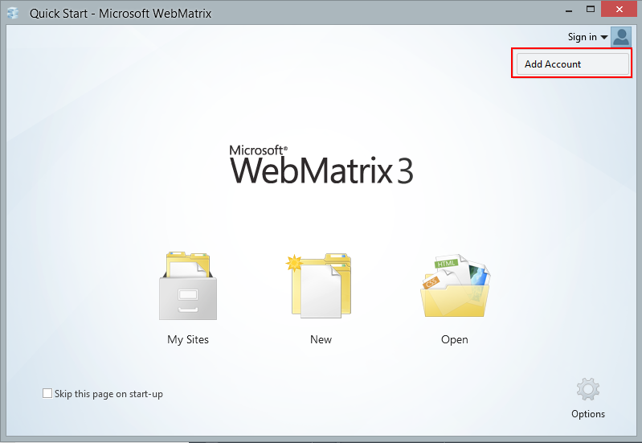

<properties linkid="develop-dotnet-website-with-webmatrix" urlDisplayName="Website with WebMatrix" pageTitle=".NET web site with WebMatrix - Azure tutorials" metaKeywords="WebMatrix Azure, WebMatrix Azure, Azure web site WebMatrix, Azure website WebMatrix, Web Matrix Azure, WebMatrix Azure" description="Learn how to develop and deploy an Azure web site with WebMatrix." metaCanonical="" services="web-sites" documentationCenter=".NET" title="Develop and deploy a web site with Microsoft WebMatrix" authors="" solutions="" manager="" editor="" />

Sviluppo e distribuzione di un sito Web con Microsoft WebMatrix
===============================================================

In questa guida viene illustrato l'utilizzo di Microsoft WebMatrix per creare e distribuire un sito Web in Azure. Verrà utilizzata un'applicazione di esempio da un modello di sito WebMatrix.

Si apprenderà come:

-   Accedere ad Azure da WebMatrix
-   Creare un sito utilizzando un modello predefinito con WebMatrix
-   Distribuire il sito Web personalizzato direttamente da WebMatrix in Azure

[WACOM.INCLUDE [create-account-and-websites-note](../includes/create-account-and-websites-note.md)]

Accesso ad Azure
----------------

1.  Avviare WebMatrix.
2.  Se è la prima volta che si utilizza WebMatrix 3, verrà richiesto di effettuare l'accesso ad Azure. In caso contrario, è possibile fare clic sul pulsante **Sign In** e scegliere **Add Account**. Scegliere **Sign in** utilizzando il proprio account Microsoft.

    

3.  Se è stata effettuata l'iscrizione per un account Azure, è possibile accedere con il proprio account Microsoft:

    

Creazione di un sito utilizzando un modello predefinito per Azure
-----------------------------------------------------------------

1.  Nella schermata Start fare clic sul pulsante **New** e scegliere **Template Gallery** per creare un nuovo sito dalla raccolta modelli:

    

2.  La raccolta modelli contiene un elenco dei modelli disponibili che è possibile eseguire in locale in Azure. Selezionare **Bakery** nell'elenco di modelli, immettere **bakerysample** per **Site Name** e fare clic su **Avanti**.

    

3.  Se è stato effettuato l'accesso ad Azure, a questo punto è possibile creare un sito Web di Azure per il sito locale. Scegliere un nome univoco e selezionare il data center in cui si desidera venga creato il sito:

    

    Dopo la creazione del sito Web con WebMatrix, verrà visualizzato l'ambiente IDE WebMatrix:

    

Test del sito Web
-----------------

L'esempio bakery include un modulo d'ordine simulato che invia un messaggio di posta elettronica con l'elemento ordinato a un account Windows Live Hotmail specificato.

1.  Nel pannello di navigazione sinistro di WebMatrix espandere la cartella **bakerysample**.

    

2.  Aprire la pagina *Order.cshtml* facendo doppio clic sul nome file.

    

3.  Individuare il commento //SMTP Configuration for Hotmail.

    

4.  Modificare i valori nelle righe seguenti in base a quelli del proprio provider di posta elettronica:

         WebMail.SmtpServer = "smtp.live.com";
         WebMail.SmtpPort  = 25;
         WebMail.EnableSsl = true; 

         //Enter your Hotmail credentials for UserName/Password and a "From" address for the e-mail
         WebMail.UserName = "";
         WebMail.Password = "";
         WebMail.From = "";

    Sostituire il valore di WebMail.SmtpServer con il nome del server di posta elettronica normalmente utilizzato per l'invio di messaggi. Quindi compilare i valori relativi a nome utente e password. Impostare la proprietà From sul proprio indirizzo di posta elettronica.

5.  Sulla barra multifunzione di WebMatrix fare clic su **Run** per testare il sito.

    

6.  Fare clic su **Order Now** per uno dei prodotti e inviare un ordine a se stessi.

7.  Controllare la posta elettronica e assicurarsi di ricevere la conferma dell'ordine. Se si riscontrano difficoltà nell'invio di posta elettronica, vedere la sezione relativa ai [problemi con l'invio di posta elettronica](http://go.microsoft.com/fwlink/?LinkId=253001#email) nella guida alla risoluzione dei problemi delle pagine Web ASP.NET (Razor).

Distribuzione del sito Web personalizzato da WebMatrix in Azure
---------------------------------------------------------------

1.  In WebMatrix fare clic su **Publish** sulla barra multifunzione **Home** per visualizzare la finestra di dialogo **Publish Preview** relativa al sito Web.

    

2.  Fare clic per selezionare la casella di controllo accanto a bakery.sdf e quindi fare clic su **Continue**. Quando la pubblicazione viene completata, nella parte inferiore dell'IDE WebMatrix viene visualizzato l'URL del sito Web aggiornato in Azure.

    

3.  Fare clic sul collegamento per aprire il sito Web nel browser:

    

    Per trovare l'URL del sito Web, è anche possibile fare clic su **Web Sites** nel portale di Azure per visualizzare tutti i siti Web disponibili per la sottoscrizione. L'URL di ogni sito Web viene visualizzato nella colonna URL della pagina di siti Web.

Modifica del sito Web e ripubblicazione nel sito Web di Azure
-------------------------------------------------------------

È possibile utilizzare WebMatrix per modificare il sito e ripubblicarlo nel sito Web di Azure. Nella procedura seguente verrà aggiunta una casella di controllo per indicare che l'ordine è un regalo.

1.  Aprire la pagina *Order.cshtml*.

2.  Individuare la definizione del modulo della classe "shiping". Inserire il codice seguente dopo il blocco &lt;li\>.

         <li class="gift">
             

                 <label for="isGift">This is a gift</label>           
                 
@Html.CheckBox("isGift")

             

         </li>

    

3.  Individuare la riga "var shipping = Request["orderShipping"];" nel file e inserire subito dopo la riga di codice seguente.

         var gift = Request["isGift"];

4.  Dopo il blocco di codice che convalida che il campo dell'indirizzo di spedizione non è vuoto, inserire il frammento di codice seguente.

         if(gift != null) {
             body += "This is a gift." + " ";
         }

    L'aspetto del file *order.cshtml* dovrebbe essere simile al seguente.

    

5.  Salvare il file, eseguire il sito in locale e inviare a se stessi un ordine di test. Assicurarsi di testare la nuova casella di controllo.

    

6.  Ripubblicare il sito facendo clic su **Publish** sulla barra multifunzione **Home**.

7.  Nella finestra di dialogo **Publish Preview** assicurarsi che il file Order.cshtml sia selezionato e fare clic su Continue.

8.  Fare clic sul collegamento per aprire il sito Web nel browser e testare l'aggiornamento nel sito Web di Azure.

Passaggi successivi
===================

Si è appreso come creare e distribuire un sito Web da WebMatrix in Azure. Per ulteriori informazioni su WebMatrix, fare riferimento alle risorse seguenti:

-   [WebMatrix per Azure](http://go.microsoft.com/fwlink/?LinkID=253622&clcid=0x409)

-   [Sito Web di WebMatrix](http://www.microsoft.com/click/services/Redirect2.ashx?CR_CC=200106398)

