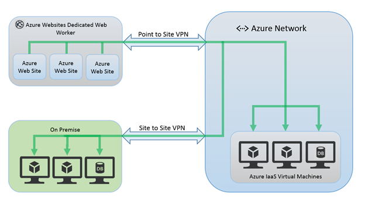
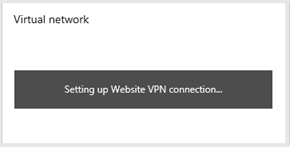

<properties 
	pageTitle="Integrazione di un'app Web in una rete virtuale di Azure" 
	description="In questo articolo viene illustrato come connettere un'app Web di Azure nel servizio app di Azure a una rete virtuale di Azure nuova o esistente" 
	services="app-service\web" 
	documentationCenter="" 
	authors="cephalin" 
	manager="wpickett" 
	editor=""/>

<tags 
	ms.service="app-service-web" 
	ms.workload="web" 
	ms.tgt_pltfrm="na" 
	ms.devlang="na" 
	ms.topic="article" 
	ms.date="03/24/2015" 
	ms.author="cephalin"/>

# Integrazione di un'app Web in una rete virtuale di Azure #
Questo documento descrive la funzionalità di anteprima dell'integrazione con una rete virtuale, specificando come configurarla con App Web in [Azure App Service](http://go.microsoft.com/fwlink/?LinkId=529714). Le Reti Virtuali di Azure consentono di compilare soluzioni ibride con le proprie risorse su Azure e in sede.

Tale integrazione consente all'app Web di accedere alle risorse presenti nella propria rete virtuale. Al contrario, l'accesso all'app Web dalla rete virtuale non viene concesso. Uno scenario standard è rappresentato dall'esigenza di accedere dalla propria app Web a un database o a servizi Web in esecuzione su macchine virtuali in una rete virtuale o in un data center. La funzionalità non consente di montare un'unità e, attualmente, non supporta l'attivazione dell'integrazione con i sistemi di autenticazione della propria rete virtuale. La funzionalità è in stato di anteprima e continuerà a essere migliorata fino a raggiungere lo stato di GA.

Per ulteriori informazioni sulle Reti Virtuali di Azure, consultare le Informazioni generali sulla rete virtuale, in cui vengono illustrati alcuni casi di utilizzo e i vantaggi di una Rete Virtuale di Azure.

## Introduzione ##
Prima di procedere con la connessione della propria app Web a una rete virtuale, è opportuno prendere in considerazione i seguenti aspetti.

1.	Le app Web possono connettersi a una rete virtuale solo se sono in esecuzione su un piano del servizio app al livello di prezzo "Standard". Le app Web con piani gratuito, condiviso e base non possono connettersi a una rete virtuale.
2.	Se la rete virtuale di destinazione esiste già, deve essere Point-to-Site con un gateway di routing dinamico per poter eseguire la connessione a un'app Web. Non è possibile attivare la VPN Point-to-Site se il gateway è configurato con il routing statico.
3.	È possibile disporre di un massimo di 5 reti configurate nel proprio piano del servizio app. Un'app Web può connettersi a una rete alla volta. Le 5 reti possono essere usate da un numero qualsiasi di app Web nello stesso piano del servizio app.  

È possibile connettersi a una rete virtuale nuova o a una esistente. In caso di creazione di una nuova rete, un gateway viene preconfigurato per l'utente. La creazione e la configurazione di una nuova rete virtuale richiede diversi minuti.

Se l'app Web non è contenuta in un piano Standard, l'interfaccia lo comunica all'utente e consente di accedere ai livelli di prezzo per eseguire l'upgrade.

## Funzionamento del sistema ##
Questa funzionalità usa la tecnologia VPN Point-to-Site per connettere l'app Web alla rete virtuale. Le app Web nel servizio app di Azure presentano un'architettura del sistema multi-tenant che preclude il provisioning di un'app Web direttamente in una rete virtuale come si fa con le macchine virtuali. Grazie al ricorso alla tecnologia Point-to-Site, è possibile consentire l'accesso di rete solo alla macchina virtuale che ospita l'app Web. L'accesso alla rete è ulteriormente limitato su questi host di app Web, in modo tale da consentire alle proprie app Web di accedere solo alle reti appositamente configurate a tal fine.

Permettendo solo a determinate app Web di connettersi alle proprie reti si evita la creazione di connessioni SMB. Sebbene sia possibile accedere a risorse remote, non è possibile montare un'unità in remota.

 
Se non è stato configurato un server DNS con la propria rete virtuale, è necessario usare gli indirizzi IP. Assicurarsi di esporre le porte per gli endpoint desiderati attraverso il proprio firewall. Per testare la connessione, l'unico metodo attualmente disponibile è il ricorso a un'app Web o a un processo Web che effettua una chiamata all'endpoint desiderato. Strumenti come ping o nslookup al momento non funzionano con la console Kudu. Presto verranno apportati miglioramenti in tale ambito.

## Connessione a una rete esistente ##
Per connettere un'app Web a una rete virtuale andare al pannello dell'app Web, fare clic sul riquadro della rete virtuale nella sezione Reti e selezionare una delle reti esistenti.

 
Se si tratta della prima app Web della propria sottoscrizione che effettua la connessione alla rete, il sistema crea un certificato per l'autenticazione della rete virtuale. Per vedere il certificato, accedere al [portale di Azure](http://go.microsoft.com/fwlink/?LinkId=529715), andare a Reti virtuali, selezionare la rete, quindi selezionare la scheda Certificati.

Nell'immagine in alto è presente una rete chiamata cantConnectVnet visualizzata in grigio che non può essere selezionata. I motivi possibili sono due: La funzionalità VPN Point-to-Site non è attivata sulla rete o non è stato effettuato il provisioning di un gateway di routing dinamico nella propria rete virtuale. Se entrambi i criteri sono soddisfatti, è possibile selezionare la rete virtuale per l'integrazione con la propria app Web.

## Creazione e connessione a una nuova rete virtuale ## ##
Oltre a effettuare la connessione a una rete virtuale esistente, è possibile crearne una dall'interfaccia utente del portale di Azure e connettersi automaticamente a tale rete virtuale. Per farlo, seguire lo stesso percorso per raggiungere l'interfaccia della rete virtuale e selezionare Crea nuova rete virtuale. L'interfaccia utente che si apre consente di assegnare un nome alla rete, specificare lo spazio di indirizzi e impostare gli indirizzi per i server DNS utilizzati dalla rete virtuale.

 
La creazione di una nuova rete virtuale con i gateway configurati può richiedere fino a 30 minuti. Durante questo intervallo di tempo, viene visualizzato il seguente messaggio che comunica l'operazione in corso.

Una volta collegata la rete all'app Web, quest'ultima può accedere alle risorse della rete virtuale tramite TCP o UDP. Se si desidera accedere alle risorse nel sistema locale disponibili tramite VPN da sito a sito, è necessario aggiungere le route alla propria rete aziendale per consentire al traffico di passare dalla rete agli indirizzi Point-to-Site configurati nella propria rete virtuale.

Una volta completata correttamente l'integrazione, nel portale di Azure è possibile visualizzare i dati principali sulla connessione, disconnettere l'app Web dalla rete e sincronizzare i certificati usati per autenticare la connessione. Se un certificato è scaduto o è stato revocato, potrebbe essere necessario procedere con la sincronizzazione.

##Gestione della connessione alla rete virtuale##
È possibile visualizzare un elenco di tutte le reti virtuali attualmente associate ad app Web in un piano del servizio app visitando il pannello di tale piano. È possibile disporre di un massimo di 5 reti associate a un piano del servizio app "standard".

Se il piano del servizio app passa a un livello inferiore (gratuito, condiviso o base), le connessioni alla rete virtuale usate dalle app Web del piano vengono disattivate. Se, in seguito, il piano torna al livello standard, le connessioni alla rete vengono ripristinate.

Al momento Azure non consente di prelevare una macchina virtuale esistente e trasferirla in una rete virtuale. Il provisioning della macchina virtuale deve essere effettuato in tale rete virtuale durante la creazione.

## Accesso alle risorse in sede ##
Quando si usa una rete virtuale configurata con una VPN da sito a sito, è necessario effettuare un'altra procedura per fornire l'accesso alle risorse locali dalla propria app Web. Le route devono essere aggiunte alla propria rete locale per consentire al traffico di passare dalla propria rete agli indirizzi Point-to-Site configurati nella propria rete virtuale. Per vedere l'intervallo di indirizzi IP per la connettività Point-to-Site, andare all'area Rete nel portale di Azure come mostrato nella seguente immagine.

## Certificati ##
Per stabilire una connessione protetta con la propria rete virtuale, è necessario procedere con uno scambio di certificati. Nella seguente immagine viene visualizzata l'identificazione personale del certificato pubblico generata dalle app Web dal portale di rete corrente.

Se i certificati risultano non sincronizzati per qualunque motivo, ad esempio sono stati eliminati involontariamente dal portale di rete, la connettività si interrompe. L'opzione Sincronizza connessione nell'interfaccia della rete virtuale dell'app Web consente di ristabilire la connettività.

Questa opzione deve essere utilizzata anche se si aggiunge un DNS alla propria rete virtuale o una VPN da sito a sito alla propria rete.

## Confronto con le connessioni ibride ##
Le app Web offrono anche una funzionalità chiamata Connessioni ibride che presenta alcuni punti in comune con l'integrazione con la rete virtuale. Sebbene vi sia una parziale sovrapposizione, nessuna delle due funzionalità può sostituire l'altra. Le connessioni ibride consentono di stabilire collegamenti a più endpoint di applicazioni in varie reti. La funzionalità Reti virtuali consente di connettere la propria app Web a una rete virtuale che, a sua volta, può essere collegata alla propria rete locale. Questa configurazione risulta ottimale se le proprie risorse si trovano tutte all'interno di tale rete.

Un'altra differenza è rappresentata dalla necessità di installare un agente di inoltro per consentire alle connessioni ibride di funzionare. L'agente deve essere eseguito su un'istanza di Windows Server. La funzionalità della rete virtuale, al contrario, non richiede alcuna installazione e abilita l'accesso alla risorse remote, indipendentemente dai sistemi operativi host.

Inoltre, sono attualmente presenti differenze a livello di prezzo tra le due funzionalità. In effetti, ai livelli più economici, la funzionalità delle connessioni ibride è molto utile per gli scenari di sviluppo e collaudo e fornisce l'accesso a un numero limitato di endpoint. La funzionalità della rete virtuale fornisce invece un accesso a tutti i contenuti presenti nella VNET o collegati alla stessa.

>[AZURE.NOTE]Per iniziare a usare Servizio app di Azure prima di registrarsi per ottenere un account Azure, andare a [Prova il servizio app](http://go.microsoft.com/fwlink/?LinkId=523751), dove è possibile creare un'app Web iniziale temporanea nel servizio app. Non è necessario fornire una carta di credito né impegnarsi in alcun modo.

## Modifiche apportate
* Per una Guida per la modifica di siti Web al servizio App vedere: [servizio App Azure e il relativo impatto sui servizi di Azure esistente](http://go.microsoft.com/fwlink/?LinkId=529714)
* Per una Guida per la modifica del portale precedente per il nuovo portale, vedere: [riferimento per lo spostamento tra il portale di anteprima](http://go.microsoft.com/fwlink/?LinkId=529715)

<!--HONumber=54-->