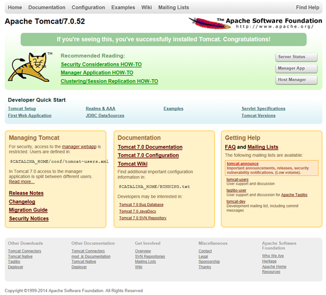

<properties urlDisplayName="Get started with Azure" pageTitle="Introduzione a Siti Web di Microsoft Azure usando Java" metaKeywords="" description="Esercitazione che illustra come distribuire un sito Web Java in Microsoft Azure." metaCanonical="" services="web-sites" documentationCenter="Java" title="Get started with Azure and Java" videoId="" scriptId="" authors="robmcm" solutions="" manager="wpickett" editor="mollybos" />

<tags ms.service="web-sites" ms.workload="web" ms.tgt_pltfrm="na" ms.devlang="Java" ms.topic="article" ms.date="09/25/2014" ms.author="robmcm" />

# Introduzione a Siti Web di Azure e Java

In questa esercitazione viene illustrato come creare un sito Web in Microsoft Azure usando Java e la raccolta di applicazioni di Azure o l'interfaccia utente della configurazione dei siti Web di Azure. 

Se non si vuole usare nessuna di queste tecniche, ad esempio perché si preferisce personalizzare il proprio contenitore di applicazioni, vedere [Caricare un sito Web Java personalizzato in Azure](../web-sites-java-custom-upload).

> [WACOM.NOTE] Per completare l'esercitazione, è necessario un account Microsoft Azure. Se non si dispone di un account, è possibile <a href="/it-it/pricing/member-offers/msdn-benefits-details/?WT.mc_id=A261C142F" target="_blank">attivare i benefici della sottoscrizione MSDN</a> oppure <a href="/it-it/pricing/free-trial/?WT.mc_id=A261C142F" target="_blank">iscriversi per ottenere una versione di valutazione gratuita</a>. 
> 
> Per iniziare a usare Siti Web di Azure prima di iscriversi per ottenere un account, visitare la pagina all'indirizzo <a href="https://trywebsites.azurewebsites.net/?language=java">https://trywebsites.azurewebsites.net</a>, in cui è possibile creare immediatamente e gratuitamente un sito di base ASP.NET temporaneo in Siti Web di Azure. Non è necessario fornire una carta di credito né impegnarsi in alcun modo.

# Creare un sito Web Java usando la raccolta di applicazioni di Azure

Queste informazioni mostrano come usare la raccolta di applicazioni di Azure per selezionare un contenitore di applicazioni Java (Apache Tomcat o Jetty) per il proprio sito Web.

Di seguito è illustrato l'aspetto di un sito Web creato usando Tomcat dalla raccolta di applicazioni:

Di seguito è illustrato l'aspetto di un sito Web creato usando Jetty dalla raccolta di applicazioni:

1. Accedere al portale di gestione di Microsoft Azure.
2. Fare clic su **Nuovo**, **Calcolo**, **Sito Web **e quindi fare clic su **Da raccolta**.
3. Selezionare uno dei server applicazioni Java dall'elenco di app, ad esempio **Apache Tomcat** o **Jetty**.
4. Fare clic su **Next**.
5. Specificare il nome di URL.
6. Scegliere un'area, ad esempio **West US**.
7. Fare clic su **Operazione completata**.

Il sito Web verrà creato dopo alcuni istanti. Per visualizzare il sito Web, nella visualizzazione **Siti Web** del portale di gestione di Azure, attendere che lo stato visualizzato corrisponda a **In esecuzione** e quindi fare clic sull'URL relativo al sito Web.

Dopo avere creato un sito Web con un contenitore per le app, vedere la sezione **Passaggi successivi** per informazioni sul caricamento dell'applicazione nel sito Web.

# Creare un sito Web Java usando l'interfaccia utente di configurazione di Azure

Queste informazioni mostrano come usare l'interfaccia utente di configurazione di Azure per selezionare un contenitore di applicazioni Java (Apache Tomcat o Jetty) per il proprio sito Web.

1. Accedere al portale di gestione di Microsoft Azure.
2. Fare clic su **Nuovo**, **Calcolo**, **Sito Web **e quindi fare clic su **Creazione rapida**.
3. Specificare il nome di URL.
4. Scegliere un'area, ad esempio **West US**.
5. Fare clic su **Operazione completata**. Il sito Web verrà creato dopo alcuni istanti. Per visualizzare il sito Web, nella visualizzazione **Siti Web** del portale di gestione di Azure, attendere che lo stato visualizzato corrisponda a **In esecuzione** e quindi fare clic sull'URL relativo al sito Web.
6. Sempre dall'interno del portale di gestione di Azure, nella visualizzazione **Siti Web**, fare clic sul nome del sito Web per aprirne il 
dashboard.
7. Fare clic su **Configura**.
8. Nella sezione **Generale** abilitare **Java** facendo clic sulla versione disponibile.
9. Vengono visualizzate le opzioni per il contenitore Web, ad esempio Tomcat e Jetty. Selezionare il contenitore Web che si desidera usare. 
10. Fare clic su **Salva**. 

Dopo alcuni secondi il sito Web diventerà basato su Java. Per verificare che il sito Web sia basato su Java, nella visualizzazione **Siti Web** del portale di gestione di Azure, attendere che lo stato visualizzato corrisponda a **In esecuzione**, quindi fare clic sull'URL relativo al sito Web. Si noti che nella pagina verrà visualizzato del testo che indica che il nuovo sito è un sito Web basato su Java.

Dopo avere creato un sito Web con un contenitore per le app, vedere la sezione **Passaggi successivi** per informazioni sul caricamento dell'applicazione nel sito Web.

# Passaggi successivi

A questo punto si dispone di un server applicazioni Java in esecuzione come sito Web Java in Azure. Per aggiungere la propria applicazione o pagina Web, vedere [Aggiunta di un'applicazione o di una pagina Web a un sito Web Java](../web-sites-java-add-app).

<!--HONumber=35.2-->
