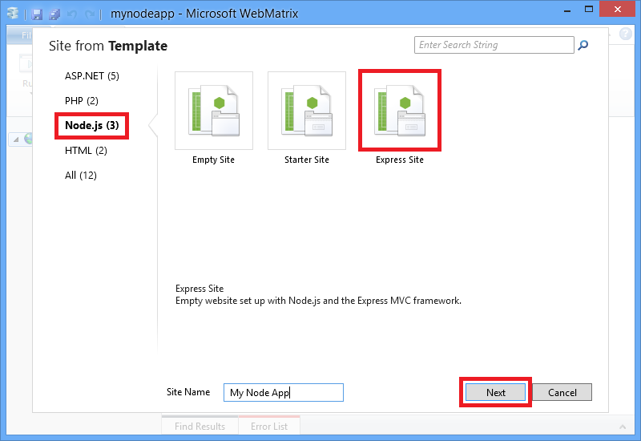
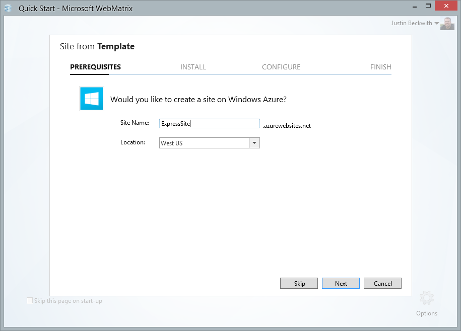
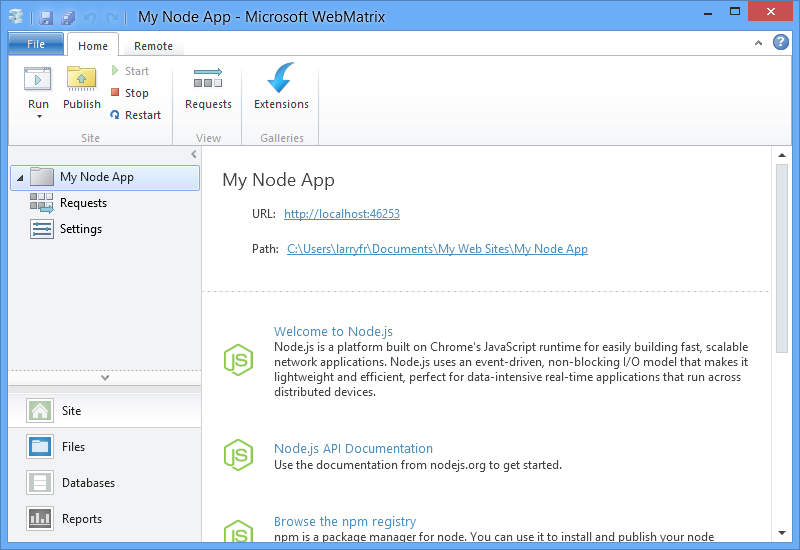
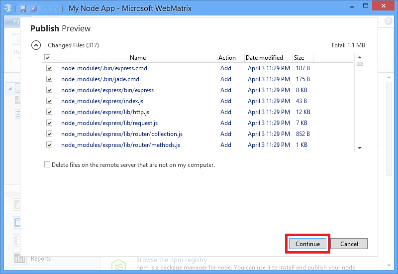
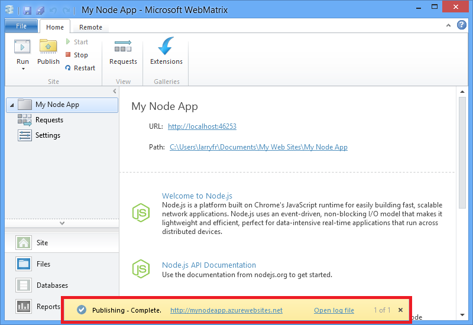
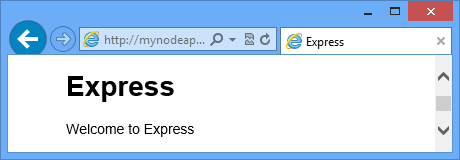
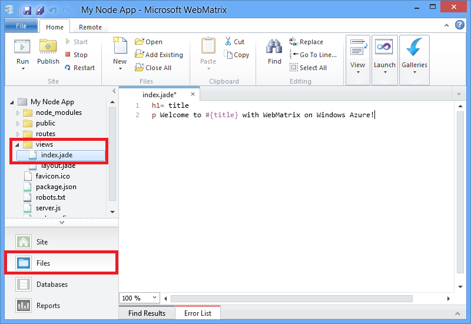
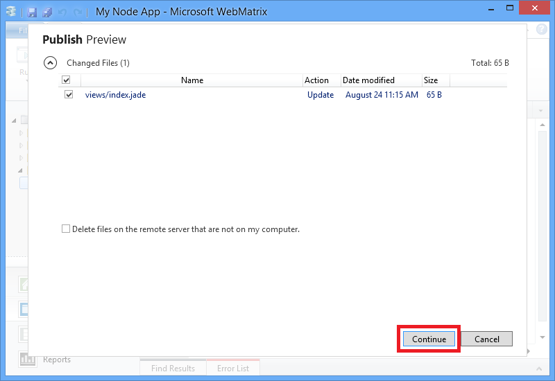

<properties linkid="web-site-with-webmatrix" urlDisplayName="Web site with WebMatrix" pageTitle="Node.js web site with WebMatrix - Azure tutorial" metaKeywords="" description="A tutorial that teaches you how to WebMatrix to develop and deploy a Node.js application to an Azure web site." metaCanonical="" services="web-sites" documentationCenter="Node.js" title="Build and deploy a Node.js web site to Azure using WebMatrix" authors="" solutions="" manager="" editor="" />

Creazione e distribuzione di un sito Web Node.js in Azure con WebMatrix
=======================================================================

In questa esercitazione viene illustrato come utilizzare WebMatrix per sviluppare e distribuire un'applicazione Node.js in un sito Web di Azure. WebMatrix è uno strumento di sviluppo Web gratuito di Microsoft che include tutto quanto necessario per lo sviluppo di siti Web. In WebMatrix sono incluse numerose funzionalità che semplificano l'utilizzo di Node.js, ad esempio completamento del codice, modelli precompilati e supporto dell'editor per Jade, LESS e CoffeScript. Ulteriori informazioni su [WebMatrix per Azure](http://go.microsoft.com/fwlink/?LinkID=253622&clcid=0x409).

Dopo avere completato questa guida, si disporrà di un sito Web Node.js in esecuzione in Azure.

Di seguito è riportata una schermata dell'applicazione completata:

[WACOM.INCLUDE [create-account-and-websites-note](../includes/create-account-and-websites-note.md)]

Accesso ad Azure
----------------

Per creare un sito Web di Azure, eseguire la procedura seguente:

**Nota**

Per completare questa esercitazione, è necessario disporre di un account Azure in cui sia abilitata la funzionalità Siti Web di Azure.

Se non si dispone di un account, è possibile creare un account di valutazione gratuita in pochi minuti. Per informazioni dettagliate, vedere la pagina relativa alla [versione di valutazione gratuita di Azure](http://www.windowsazure.com/it-it/pricing/free-trial/?WT.mc_id=A7171371E).

1.  Avvio di WebMatrix
2.  Se è la prima volta che si utilizza WebMatrix, verrà richiesto di effettuare l'accesso ad Azure. In caso contrario, è possibile fare clic sul pulsante **Sign In** e scegliere **Add Account**. Scegliere **Sign in** utilizzando il proprio account Microsoft.

    

3.  Se è stata effettuata l'iscrizione per un account Azure, è possibile accedere con il proprio account Microsoft:

    

Creazione di un sito utilizzando un modello predefinito per Azure
-----------------------------------------------------------------

1.  Nella schermata Start fare clic sul pulsante **New** e scegliere **Template Gallery** per creare un nuovo sito dalla raccolta modelli:

    

2.  Nella finestra di dialogo **Site from Template** selezionare **Node** e quindi **Express Site**. Infine, fare clic su **Next**. Se non sono presenti tutti i prerequisiti necessari per il modello **Express Site**, verrà richiesto di installarli.

    

3.  Se è stato effettuato l'accesso ad Azure, a questo punto è possibile creare un sito Web di Azure per il sito locale. Scegliere un nome univoco e selezionare il data center in cui si desidera venga creato il sito:

    

4.  Dopo la creazione del sito Web con WebMatrix, verrà visualizzato l'ambiente IDE WebMatrix.

    

Pubblicazione dell'applicazione in Azure
----------------------------------------

1.  In WebMatrix fare clic su **Publish** sulla barra multifunzione **Home** per visualizzare la finestra di dialogo **Publish Preview** relativa al sito Web.

    

2.  Fare clic su **Continue**. Quando la pubblicazione viene completata, nella parte inferiore dell'IDE WebMatrix viene visualizzato l'URL del sito Web in Azure.

    

3.  Fare clic sul collegamento per aprire il sito Web nel browser.

    

Modifica e ripubblicazione dell'applicazione
--------------------------------------------

Modificare e ripubblicare l'applicazione è facile. Ora, si procederà all'aggiunta di una semplice modifica all'intestazione nel file **index.jade** e si ripubblicherà l'applicazione.

1.  In WebMatrix selezionare **Files**, quindi espandere la cartella **views**. Fare doppio clic sul file **index.jade** per aprirlo.

    

2.  Sostituire la seconda riga con la riga seguente:

         p Welcome to #{title} with WebMatrix on Azure!

3.  Salvare le modifiche e quindi fare clic sull'icona di pubblicazione. Infine, fare clic su **Continue** nella finestra di dialogo**Publish Preview** e attendere che l'aggiornamento venga pubblicato.

    

4.  Dopo che la pubblicazione è completata, utilizzare il collegamento restituito al termine del processo di pubblicazione per visualizzare il sito aggiornato.

    

Passaggi successivi
-------------------

Per informazioni sulle versioni di Node.js fornite con Azure e su come specificare la versione da utilizzare con l'applicazione, vedere [Specifica di una versione di Node.js in un'applicazione Azure](http://www.windowsazure.com/it-it/develop/nodejs/common-tasks/specifying-a-node-version/).

Se si verificano problemi con l'applicazione dopo la distribuzione in Azure, vedere [Come eseguire il debug di un'applicazione Node.js in Siti Web di Azure](http://www.windowsazure.com/it-it/develop/nodejs/how-to-guides/Debug-Website/) per informazioni su come diagnosticare l'errore.

