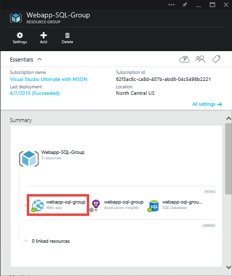
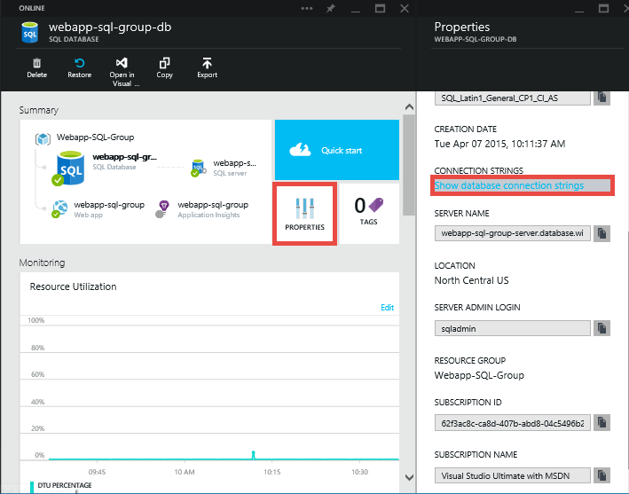
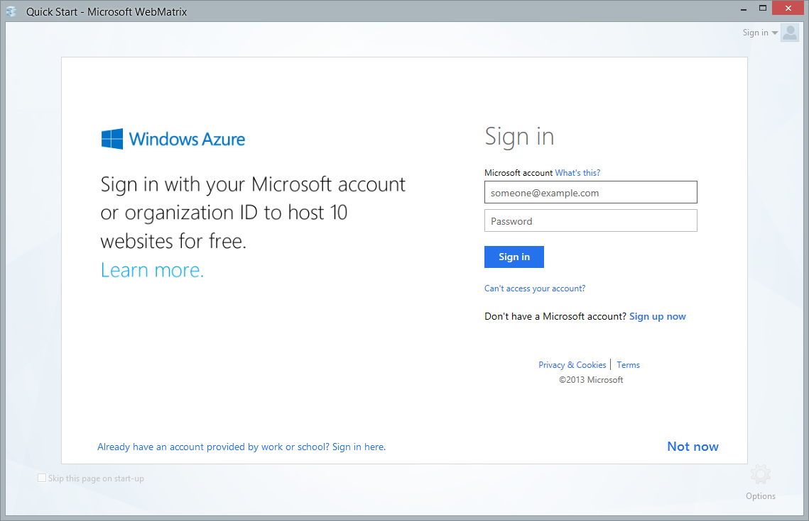
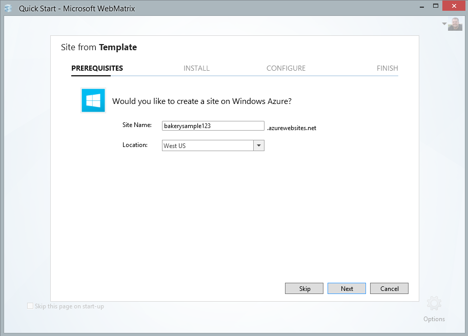
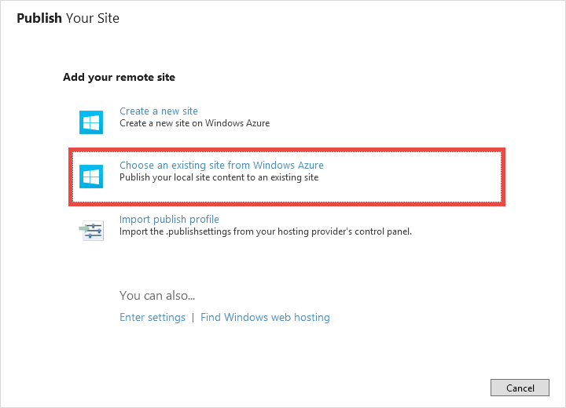

<properties 
	pageTitle="Creare e distribuire un'applicazione web di PHP-SQL nel servizio di applicazione Azure con WebMatrix" 
	description="Un'esercitazione che illustra come usare l'IDE di WebMatrix gratuito per creare e distribuire un sito Web PHP che archivia i dati nel database SQL." 
	tags="azure-portal"
	services="app-service\web" 
	documentationCenter="" 
	authors="tfitzmac" 
	manager="wpickett" 
	editor="mollybos"/>

<tags 
	ms.service="app-service-web" 
	ms.workload="web" 
	ms.tgt_pltfrm="na" 
	ms.devlang="PHP" 
	ms.topic="article" 
	ms.date="04/29/2015" 
	ms.author="tomfitz"/>

# Creare e distribuire un'applicazione web di PHP-SQL nel servizio di applicazione Azure con WebMatrix

In questa esercitazione viene illustrato come utilizzare WebMatrix per sviluppare e distribuire un'applicazione PHP che utilizza un database SQL in [servizio App Azure](http://go.microsoft.com/fwlink/?LinkId=529714) applicazioni Web. WebMatrix è uno strumento di sviluppo Web gratuito di Microsoft che include tutto quanto necessario per lo sviluppo di app Web. WebMatrix supporta PHP e comprende IntelliSense per lo sviluppo di PHP.

In questa esercitazione si presuppone che l'utente abbia installato [SQL Server Express][install-SQLExpress] nel computer in modo che sia possibile testare un'applicazione in locale. È tuttavia possibile completare l'esercitazione senza aver installato SQL Server Express. L'applicazione può infatti essere distribuita direttamente sui siti Web di Azure.

Dopo avere completato questa guida, si disporrà di un database SQL-PHP in esecuzione in Azure.
 
Si acquisiranno le nozioni seguenti:

* Come creare un'applicazione web nell'applicazione servizio Web App e un Database SQL mediante il [portale Azure preview](http://go.microsoft.com/fwlink/?LinkId=529715). Poiché PHP è abilitato in App Web di Azure per impostazione predefinita, non è necessario completare operazioni speciali per eseguire il codice PHP.
* Come sviluppare un'applicazione PHP con WebMatrix.
* Come pubblicare e ripubblicare l'applicazione in Azure con WebMatrix.
 
Seguendo questa esercitazione, verrà creata una semplice applicazione Web Tasklist in PHP, che verrà ospitata nelle app Web. Di seguito è riportata una schermata dell'applicazione in esecuzione:

![Sito Web PHP di Azure][running-app]

[AZURE.INCLUDE [create-account-and-websites-note](../includes/create-account-and-websites-note.md)]

>[AZURE.NOTE]Per iniziare a usare Servizio app di Azure prima di registrarsi per ottenere un account Azure, andare a [Prova il servizio app](http://go.microsoft.com/fwlink/?LinkId=523751), dove è possibile creare un'app Web iniziale temporanea nel servizio app. Non è necessario fornire una carta di credito né impegnarsi in alcun modo.

##Prerequisiti

1. [Scaricare][tasklist-sqlazure-download] i file dell'applicazione Tasklist. Si tratta di una semplice applicazione PHP che consente di aggiungere e/o eliminare gli elementi da un elenco attività oppure di contrassegnarli come completi. Gli elementi dell'elenco attività sono memorizzati in un database SQL (SQL Server Express per test locali). L'applicazione è costituita dai file seguenti:

	* **index.php**: consente di visualizzare le attività e fornisce un modulo per l'aggiunta di un elemento all'elenco.
	* **AddItem**: aggiunge un elemento all'elenco.
	* **getitems.php**: recupera tutti gli elementi nel database.
	* **markitemcomplete.php**: modifica lo stato di un elemento come completo.
	* **DeleteItem. PHP**: elimina un elemento.
	* **taskmodel.php**: contiene funzioni per aggiungere, ottenere, aggiornare ed eliminare gli elementi dal database.
	* **createtable.php**: consente di creare la tabella di database SQL per l'applicazione. Questo file verrà chiamato una volta sola.

2. Creare un database di SQL Server denominato `tasklist`. A tale scopo, immettere nel prompt dei comandi `sqlcmd` i comandi seguenti:

		>sqlcmd -S <server name>\sqlexpress -U <user name> -P <password>
		1> create database tasklist
		2> GO

	Questo passaggio è necessario solo se si desidera testare l'applicazione localmente.

## Creare un'app Web e un database MySQL

Per creare un'app Web di Azure e un database SQL, seguire questa procedura:

1. Accedere al [portale di anteprima di Azure](https://portal.azure.com).

2. Aprire Azure Marketplace facendo clic sull'icona **Marketplace** oppure sull'icona **Nuovo** in basso a sinistra nel dashboard e selezionando **Web + mobile** e poi **Azure Marketplace** in fondo.
	
3. In Marketplace, selezionare **App Web**.

4. Fare clic sull'icona **Web app + SQL**.

5. Dopo aver letto la descrizione dell'app Web e dell'SQL, fare clic su **Crea**.

6. Fare clic sulle singole parti (Gruppo di risorse, **App Web**, **Database** e **Sottoscrizione**) e immettere o selezionare i valori per i campi obbligatori:
	
	- Immettere un nome di URL a scelta.	
	- Configurare le credenziali del server di database.
	- Selezionare l'area più vicina.

	

7. Al termine della definizione dell'app Web, fare clic su **Crea**.

	Quando l'app Web viene creata, nel pulsante **Notifiche** lampeggia in verde il testo **OPERAZIONE RIUSCITA** e il pannello del gruppo di risorse si apre per visualizzare sia l'app Web sia il database SQL presenti nel gruppo.

4. Fare clic sull'icona dell'app Web nel pannello del gruppo di risorse per aprire il pannello dell'app Web.

	

##Recuperare le informazioni sulla connessione al database SQL

Per connettersi all'istanza del database SQL collegata all'app Web, saranno necessarie le informazioni di connessione specificate durante la creazione del database. Per ottenere le informazioni di connessione al database SQL, seguire questa procedura:

1. Tornando nel pannello del gruppo di risorse, fare clic sull'icona del database SQL.

2. Nel pannello del database SQL fare clic su **Proprietà**, quindi su **Mostra stringhe di connessione database**.

	
	
3. Nella sezione **PHP** della finestra di dialogo risultante prendere nota dei valori per `Server`, `SQL Database` e `User Name`. Si useranno questi valori successivamente, al momento di pubblicare l'app Web PHP in Servizio app di Azure.

## Creare l'applicazione in WebMatrix

Nei passaggi successivi verrà sviluppata l'applicazione Tasklist mediante l'aggiunta dei file precedentemente scaricati e l'esecuzione di alcune modifiche. È tuttavia possibile aggiungere i propri file esistenti o crearne di nuovi.

1. Avviare [Microsoft WebMatrix](http://www.microsoft.com/web/webmatrix/). Se già stato installato, farlo ora.
2. Se è la prima volta che si utilizza WebMatrix 3, verrà richiesto di effettuare l'accesso ad Azure. In caso contrario, è possibile fare clic sul pulsante **Sign In** e scegliere **Add Account**. Scegliere **Sign in** utilizzando il proprio account Microsoft.

	

3. Se è stata effettuata l'iscrizione per un account Azure, è possibile accedere con il proprio account Microsoft:

	

1. Nella schermata Start fare clic sul pulsante **New** e scegliere **Template Gallery** per creare un nuovo sito dalla raccolta modelli:

	

4. Scegliere **PHP** dai modelli disponibili.

	![Sito dal modello][site-from-template]

5. Selezionare il modello **Empty Site**. Specificare un nome per il sito e fare clic su **NEXT**.

	![Specificare un nome per il sito][site-from-template-2]

3. Se è stato effettuato l'accesso ad Azure, a questo punto è possibile creare un sito Web di Azure per il sito locale. Scegliere **Skip** per ora.

	

1. Dopo la creazione del sito Web con WebMatrix, verrà visualizzato l'ambiente IDE WebMatrix. Tenendo il sito aperto in WebMatrix, fare clic su **Add Existing** per aggiungere i file applicazione:

	![WebMatrix - Aggiunta di file esistenti][edit_addexisting]

	Nella finestra di dialogo risultante, passare ai file scaricati in precedenza, selezionarli tutte e fare clic su Open. Quando richiesto, scegliere di sostituire il file `index.php`.

2. Sarà quindi necessario aggiungere le informazioni sulla connessione al database al file `taskmodel.php`. Aprire il `taskmodel.php` fare doppio clic sul file e aggiornare le informazioni di connessione di database il `connect` (funzione). (* * Nota * *: passare a [pubblica l'applicazione](#Publish) se non si desidera testare l'applicazione localmente e intenda pubblicarla direttamente in Azure applicazione servizio Web Apps.)

		// DB connection info
		$host = "localhost\sqlexpress";
		$user = "your user name";
		$pwd = "your password";
		$db = "tasklist";

	Salvare il file.`taskmodel.php`

3. Affinché sia possibile eseguire l'applicazione sarà necessario creare la tabella `items`. Fare clic con il pulsante destro del mouse sul file `createtable.php` e scegliere **Avvia nel browser**. Il file `createtable.php` verrà aperto nel browser e verrà eseguito il codice che consente di creare la tabella `items` nel database `tasklist`.

	![WebMatrix - Avvio di createtable.php nel browser][edit_run]

4. A questo punto è possibile testare l'applicazione in locale. Fare clic con il pulsante destro del mouse sul file `index.php` e scegliere **Avvia nel browser**. Testare l'applicazione aggiungendo degli elementi, contrassegnandoli come completi ed eliminandoli.

## Pubblicare l'applicazione

Prima di pubblicare l'applicazione in Siti Web di Azure, è necessario aggiornare le informazioni di connessione al database nel file `taskmodel.php` con le informazioni di connessione ottenute in precedenza (nella sezione [Creare un sito Web di Azure e un database SQL](#CreateWebsite)).

1. Fare doppio clic sul file `taskmodel.php` per aprirlo e aggiornare le informazioni di connessione al database nella funzione `connect`.

		// DB connection info
		$host = "value of $serverName";
		$user = "value of UID";
		$pwd = "the SQL password you created when creating the web app";
		$db = "value of Database";
	
	Salvare il file.`taskmodel.php`

2. Fare clic su **pubblicare** in WebMatrix.

	![WebMatrix - Opzione Publish][edit_publish]

3. Fare clic su **scegliere un sito esistente di Microsoft Azure**.

	

3. Selezionare l'applicazione web di App servizio creato in precedenza.

	

3. Tenere premuto **Continua** fino a quando non WebMatrix pubblica il sito in Azure applicazione servizio Web Apps.

3. Passare a http://[yourhttp://[nome del sito Web].azurewebsites.net/createtable.php per creare la tabella `items`.

4. Infine, passare a http://[your http://[nome del sito Web].azurewebsites.net/index.php per avviare l'applicazione.
	
##Modifica e ripubblicazione dell'applicazione

Per modificare facilmente l'applicazione apportare le modifiche alla copia locale del sito scaricata in precedenza e ripubblicarla oppure modificarla direttamente in modalità **remota**. In tal modo, sarà possibile apportare una semplice modifica all'intestazione del file `index.php`, salvandolo direttamente sul sito attivo.

1. Fare clic sulla scheda **Remote** del sito in WebMatrix e selezionare **Open Remote View**. Verrà aperto i file remoto (ospitati su Web Apps) per la modifica diretta. ![WebMatrix - Apertura in visualizzazione remota][OpenRemoteView]
 
2. Aprire il `index.php` file facendovi doppio clic. ![WebMatrix - Apertura del file index][Remote_editIndex]

3. Sostituire **My ToDo List** con **My Task List** nei tag **title** e **h1**, quindi salvare il file.

4. Al termine del salvataggio, fare clic sul pulsante Run per visualizzare le modifiche sul sito attivo. ![WebMatrix - Avvio del sito in remoto][Remote_run]

## Passaggi successivi

Si è appreso come creare e distribuire un'applicazione web da WebMatrix in Azure applicazione servizio Web Apps. Per ulteriori informazioni su WebMatrix, vedere [sito web di WebMatrix](http://www.microsoft.com/click/services/Redirect2.ashx?CR_CC=200106398).

## Modifiche apportate
* Per una Guida per la modifica di siti Web al servizio App vedere: [servizio App Azure e il relativo impatto sui servizi di Azure esistente](http://go.microsoft.com/fwlink/?LinkId=529714)
* Per una Guida per la modifica del portale precedente per il portale di anteprima, vedere: [riferimento per lo spostamento tra il portale di anteprima](http://go.microsoft.com/fwlink/?LinkId=529715)

[install-SQLExpress]: http://www.microsoft.com/download/details.aspx?id=29062
[running-app]: ./media/web-sites-php-sql-database-use-webmatrix/tasklist_app_windows.png
[tasklist-sqlazure-download]: http://go.microsoft.com/fwlink/?LinkId=252504
[NewWebSite1]: ./media/web-sites-php-sql-database-use-webmatrix/NewWebSite1.jpg
[NewWebSite2]: ./media/web-sites-php-sql-database-use-webmatrix/NewWebSite2.png
[NewWebSite3_SQL]: ./media/web-sites-php-sql-database-use-webmatrix/NewWebSite3_SQL.png
[NewWebSite4_SQL]: ./media/web-sites-php-sql-database-use-webmatrix/NewWebSite4_SQL.png

[NewWebSite6_SQL]: ./media/web-sites-php-sql-database-use-webmatrix/NewWebSite6_SQL.png
[NewWebSite7]: ./media/web-sites-php-sql-database-use-webmatrix/NewWebSite7.png

[InstallWebMatrix]: ./media/web-sites-php-sql-database-use-webmatrix/InstallWebMatrix.png
[download-site]: ./media/web-sites-php-sql-database-use-webmatrix/download-site-1.png
[site-from-template]: ./media/web-sites-php-sql-database-use-webmatrix/site-from-template.png
[site-from-template-2]: ./media/web-sites-php-sql-database-use-webmatrix/site-from-template-2.png
[edit_addexisting]: ./media/web-sites-php-sql-database-use-webmatrix/edit_addexisting.png
[edit_run]: ./media/web-sites-php-sql-database-use-webmatrix/edit_run.png
[edit_publish]: ./media/web-sites-php-sql-database-use-webmatrix/edit_publish.png
[OpenRemoteView]: ./media/web-sites-php-sql-database-use-webmatrix/OpenRemoteView.png
[Remote_editIndex]: ./media/web-sites-php-sql-database-use-webmatrix/Remote_editIndex.png
[Remote_run]: ./media/web-sites-php-sql-database-use-webmatrix/Remote_run.png

[preview-portal]: https://manage.windowsazure.com

<!--HONumber=54-->