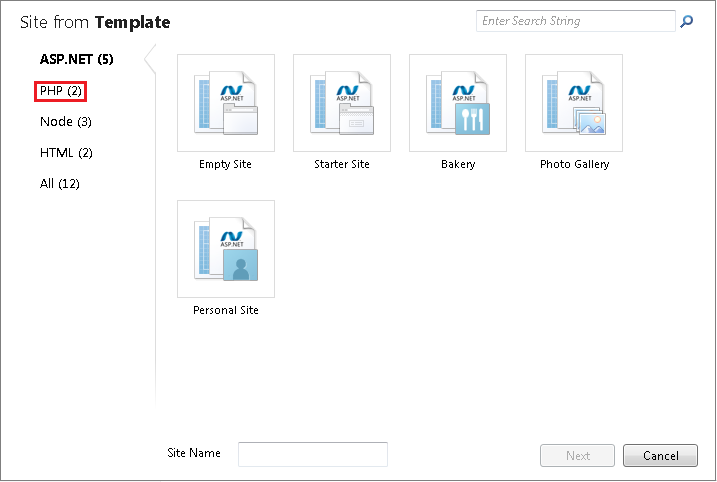
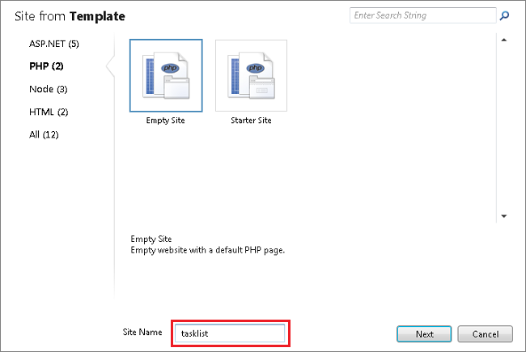
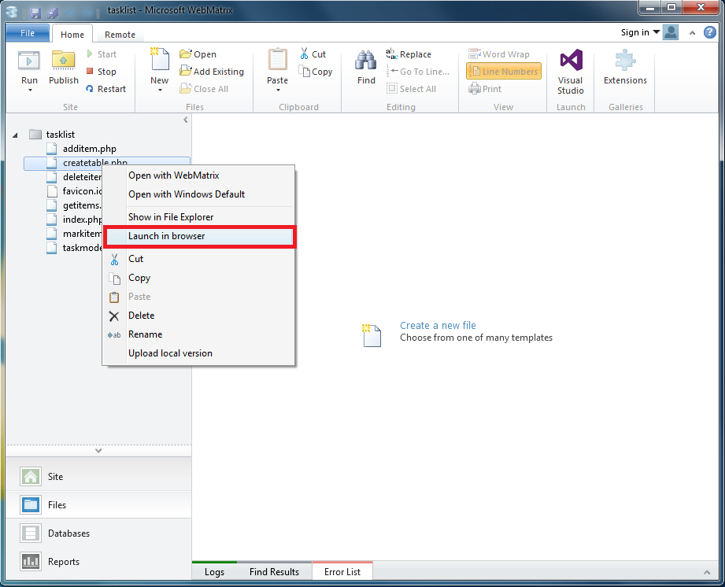
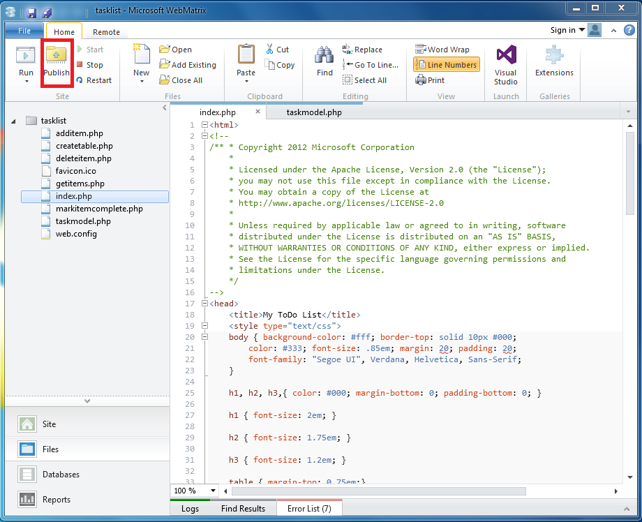
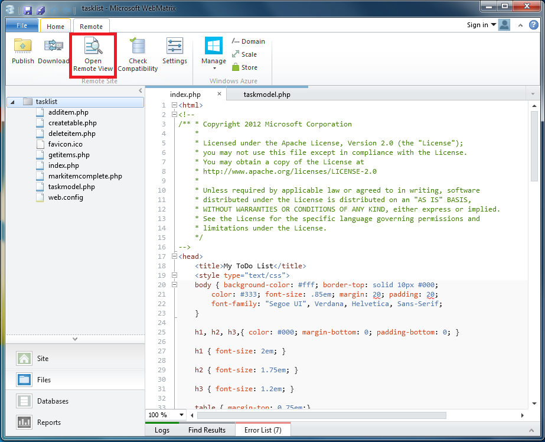
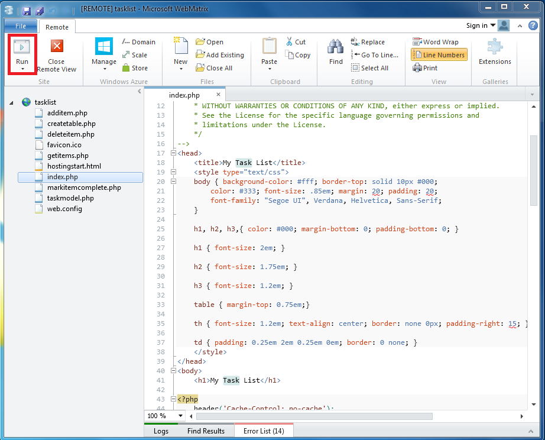

<properties linkid="develop-php-website-with-sql-database-and-webmatrix" urlDisplayName="Web w/ SQL + WebMatrix" pageTitle="PHP web site with SQL Database and WebMatrix - Azure" metaKeywords="" description="A tutorial that demonstrates how to use the free WebMatrix IDE to create and deploy a PHP web site that stores data in SQL Database." metaCanonical="" services="" documentationCenter="" title="Create and Deploy a PHP Web Site and SQL Database using WebMatrix" authors="" solutions="" manager="" editor="mollybos" />

Creazione e distribuzione di un sito Web PHP e di un database SQL con WebMatrix
===============================================================================

In questa esercitazione viene illustrato come utilizzare WebMatrix per sviluppare e distribuire un'applicazione PHP che utilizza un database SQL di Azure in un sito Web di Azure. WebMatrix è uno strumento di sviluppo Web gratuito di Microsoft che include tutto quanto necessario per lo sviluppo di siti Web. WebMatrix supporta PHP e comprende IntelliSense per lo sviluppo di PHP.

In questa esercitazione si presuppone che l'utente abbia installato [SQL Server Express](http://www.microsoft.com/it-it/download/details.aspx?id=29062) nel computer in modo che sia possibile testare un'applicazione in locale. È tuttavia possibile completare l'esercitazione senza aver installato SQL Server Express. L'applicazione può infatti essere distribuita direttamente sui siti Web di Azure.

Dopo avere completato questa guida, si disporrà di un database SQL-PHP in esecuzione in Azure.

Si apprenderà come:

-   Creare un sito Web di Azure e un database SQL utilizzando il portale di gestione di Azure. Poiché PHP è abilitato in Siti Web di Azure per impostazione predefinita, non è necessario completare operazioni speciali per eseguire il codice PHP.
-   Come sviluppare un'applicazione PHP con WebMatrix.
-   Come pubblicare e ripubblicare l'applicazione in Azure con WebMatrix.

Seguendo questa esercitazione, verrà creata una semplice applicazione Web Tasklist in PHP, ospitata in un sito Web di Azure. Di seguito è riportata una schermata dell'applicazione in esecuzione:

[WACOM.INCLUDE [create-account-and-websites-note](../includes/create-account-and-websites-note.md)]

Prerequisiti
------------

1.  [Scaricare](http://go.microsoft.com/fwlink/?LinkId=252504) i file dell'applicazione Tasklist. Si tratta di una semplice applicazione PHP che consente di aggiungere e/o eliminare gli elementi da un elenco attività oppure di contrassegnarli come completi. Gli elementi dell'elenco attività sono memorizzati in un database SQL (SQL Server Express per test locali). L'applicazione è costituita dai file seguenti:

-   **index.php**: consente di visualizzare le attività e fornisce un modulo per l'aggiunta di un elemento all'elenco.
-   **additem.php**: consente di aggiungere un elemento all'elenco.
-   **getitems.php**: consente di ottenere tutti gli elementi del database.
-   **markitemcomplete.php**: consente di modificare lo stato di un elemento come completo.
-   **deleteitem.php**: consente di eliminare un oggetto.
-   **taskmodel.php**: contiene funzioni per aggiungere, ottenere, aggiornare ed eliminare gli elementi dal database.
-   **createtable.php**: consente di creare la tabella di database SQL per l'applicazione. Questo file verrà chiamato una volta sola.

1.  Creare un database di SQL Server denominato `tasklist`. A tale scopo, immettere al prompt dei comandi `sqlcmd` i comandi seguenti:

         >sqlcmd -S <server name>\sqlexpress -U <user name> -P <password>
         1> create database tasklist
         2> GO

    Questo passaggio è necessario solo se si desidera testare l'applicazione localmente.

Creazione di un sito Web e di un database SQL
---------------------------------------------

1.  Accedere al [portale di gestione](https://manage.windowsazure.com).
2.  Fare clic sull'icona **+ New** nella parte inferiore sinistra del portale.

    

3.  Fare clic su **WEB SITE** e quindi su **CUSTOM CREATE**.

    

    Immettere un valore per **URL**, scegliere **Create a New SQL Database** nell'elenco a discesa **DATABASE**, quindi selezionare il data center per il sito Web nell'elenco a discesa **REGION**. Fare clic sulla freccia nella parte inferiore della finestra di dialogo.

    

4.  Immettere un valore per il nome del database in **NAME** e selezionare **NEW SQL Database server**. Immettere un nome utente e una password per l'accesso al server, confermare la password e scegliere l'area in cui verrà creato il nuovo server di database SQL.

    

    In seguito alla creazione del sito Web verrà visualizzato il messaggio **Creating Web Site "[NOMESITO]" succeeded**. Verranno quindi recuperate le informazioni sulla connessione al database.

5.  Fare clic su **LINKED RESOURCES**, quindi sul nome del database.

    

6.  Fare clic su **View connection strings**.

    

Nella sezione **PHP** della finestra di dialogo risultante prendere nota dei valori per `UID`, `PWD`, `Database` e `$serverName`. Queste informazioni verranno utilizzate in seguito.

Installazione di WebMatrix
--------------------------

È possibile installare WebMatrix dal [portale di gestione](https://manage.windowsazure.com).

1.  Dopo aver eseguito l'accesso, aprire la pagina di avvio rapido del sito Web e fare clic sull'icona WebMatrix nella parte inferiore della pagina:

    

    Per installare WebMatrix, attenersi alle istruzioni visualizzate.

2.  Al termine dell'installazione di WebMatrix, verrà effettuato un tentativo di apertura del sito come progetto WebMatrix. È possibile scegliere di modificare direttamente il sito attivo oppure scaricare una copia in locale. Per questa esercitazione, selezionare "Edit local copy".

3.  Quando viene richiesto di scaricare il sito, scegliere **Yes, install from the Template Gallery**.

    

4.  Scegliere **PHP** dai modelli disponibili.

    

5.  Selezionare il modello **Empty Site**. Specificare un nome per il sito e fare clic su **NEXT**.

    

Il sito verrà aperto in WebMatrix con alcuni file predefiniti.

Sviluppo dell'applicazione
--------------------------

Nei passaggi successivi verrà sviluppata l'applicazione Tasklist mediante l'aggiunta dei file precedentemente scaricati e l'esecuzione di alcune modifiche. È tuttavia possibile aggiungere i propri file esistenti o crearne di nuovi.

1.  Tenendo il sito aperto in WebMatrix, fare clic su **Add Existing** per aggiungere i file applicazione:

    

    Nella finestra di dialogo risultante, passare ai file scaricati in precedenza, selezionarli tutte e fare clic su Open. Quando richiesto, scegliere di sostituire il file `index.php`.

2.  Sarà quindi necessario aggiungere le informazioni di connessione al database SQL Server locale al file `taskmodel.php`. Fare doppio clic sul file `taskmodel.php` per aprirlo e aggiornare le informazioni di connessione al database nella funzione `connect`. (**Nota**: qualora non si desideri testare l'applicazione localmente e si intenda pubblicarla direttamente nei siti Web di Azure, passare alla sezione [Pubblicazione dell'applicazione](#Publish)).

         // DB connection info
         $host = "localhost\sqlexpress";
         $user = "your user name";
         $pwd = "your password";
         $db = "tasklist";

    Salvare il file `taskmodel.php`.

3.  Affinché sia possibile eseguire l'applicazione sarà necessario creare la tabella `items`. Fare clic con il pulsante destro del mouse sul file `createtable.php` e scegliere **Launch in browser**. Il file `createtable.php` verrà aperto nel browser e verrà eseguito il codice che consente di creare la tabella `items` nel database `tasklist`.

    

4.  A questo punto è possibile testare l'applicazione in locale. Fare clic con il pulsante destro del mouse sul file `index.php` e scegliere **Launch in browser**. Testare l'applicazione aggiungendo degli elementi, contrassegnandoli come completi ed eliminandoli.

Pubblicazione dell'applicazione
-------------------------------

Prima di pubblicare l'applicazione in Siti Web di Azure, è necessario aggiornare le informazioni di connessione al database nel file `taskmodel.php` con le informazioni di connessione ottenute in precedenza (nella sezione dedicata alla [creazione di un sito Web di Azure e un database SQL](#CreateWebsite)).

1.  Fare doppio clic sul file `taskmodel.php` per aprirlo e aggiornare le informazioni di connessione al database nella funzione `connect`.

         // DB connection info
         $host = "value of $serverName";
         $user = "value of UID";
         $pwd = "the SQL password you created when creating the web site";
         $db = "value of Database";

    Salvare il file `taskmodel.php`.

2.  Fare clic su **Publish** in WebMatrix e quindi fare clic su **Continue** nella finestra di dialogo **Publish Preview**.

    

3.  Passare a http://[nome del sito Web].azurewebsites.net/createtable.php per creare la tabella `items`.

4.  Infine, passare a http://[nome del sito Web].azurewebsites.net/index.php per avviare l'applicazione.

Modifica e ripubblicazione dell'applicazione
--------------------------------------------

Per modificare facilmente l'applicazione apportare le modifiche alla copia locale del sito scaricata in precedenza e ripubblicarla oppure modificarla direttamente in modalità remota. In tal modo, sarà possibile apportare una semplice modifica all'intestazione del file `index.php`, salvandolo direttamente sul sito attivo.

1.  Fare clic sulla scheda Remote del sito in WebMatrix e selezionare **Open Remote View**. Verrà aperto il sito remoto per le modifiche dirette.
  
	

2.  Fare doppio clic sul file `index.php` per aprirlo.

	

3.  Modificare **My ToDo List** in **My Task List** nei tag **title** e **h1**, quindi salvare il file.

4.  Al termine del salvataggio, fare clic sul pulsante Run per visualizzare le modifiche sul sito attivo. 

	

Passaggi successivi
-------------------

Si è appreso come creare e distribuire un sito Web da WebMatrix in Azure. Per ulteriori informazioni su WebMatrix, fare riferimento alle risorse seguenti:

-   [WebMatrix per Azure](http://go.microsoft.com/fwlink/?LinkID=253622&clcid=0x409)

-   [Sito Web di WebMatrix](http://www.microsoft.com/click/services/Redirect2.ashx?CR_CC=200106398)

