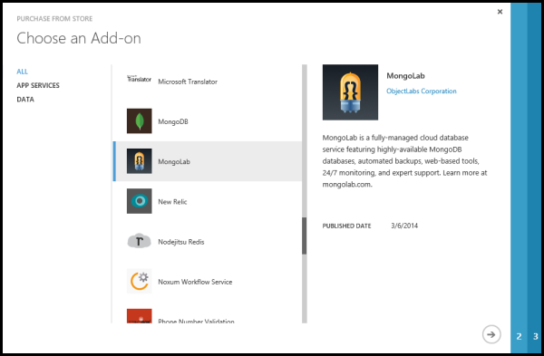
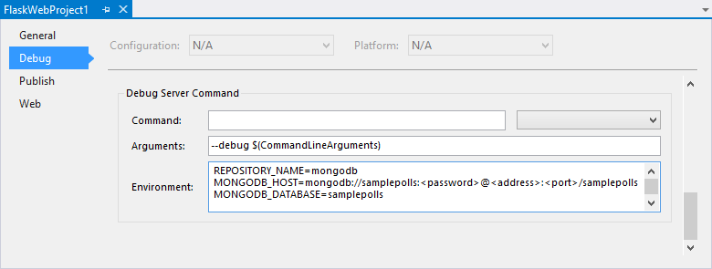
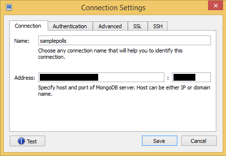
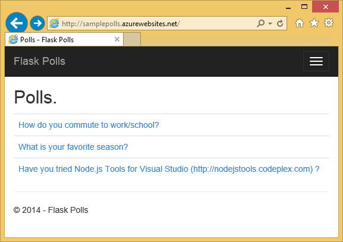

<properties 
	pageTitle="Flask e MongoDB in Azure con Python Tools 2.1 per Visual Studio" 
	description="Informazioni su come usare Python Tools per Visual Studio per creare un'applicazione Flask che archivia i dati in un'istanza del database MySQL e che può essere distribuita in un sito Web." 
	services="" 
	documentationCenter="python" 
	authors="huguesv" 
	manager="wpickett" 
	editor=""/>

<tags 
	ms.service="web-sites" 
	ms.workload="web" 
	ms.tgt_pltfrm="na" 
	ms.devlang="python" 
	ms.topic="article" 
	ms.date="10/10/2014" 
	ms.author="huvalo"/>

# Flask e MongoDB in Azure con Python Tools 2.1 per Visual Studio

In questa esercitazione verrà creata una semplice applicazione per sondaggi usando uno dei modelli di esempio PTVS. Questa esercitazione è anche disponibile sotto forma di [video](https://www.youtube.com/watch?v=eql-crFgrAE).

L'applicazione per sondaggi definisce un'astrazione per il proprio repository che consente di passare facilmente tra diversi tipi di repository (in memoria, archiviazione tabelle di Azure, MongoDB).

Si apprenderà come usare uno dei servizi MongoDB ospitati in Azure, come configurare l'applicazione per l'uso di MongoDB e come pubblicare l'applicazione in un sito Web di Azure.

Vedere il [Centro per sviluppatori Python][] per altri articoli che trattano lo sviluppo di siti Web di Azure con PTVS usando i framework Web di Bottle, Flask e Django con i servizi di MongoDB, archiviazione tabelle di Azure, MySQL e Database SQL.  Sebbene questo articolo sia incentrato su Siti Web di Azure, i passaggi sono simili a quelli dello sviluppo di [Servizi cloud di Azure][].

+ [Prerequisiti](#prerequisites)
+ [Creare il progetto](#create-the-project)
+ [Creare un database MongoDB](#create-a-mongodb-database)
+ [Configurare il progetto](#configure-the-project)
+ [Esplorare il database MongoDB](#explore-the-mongodb-database)
+ [Pubblicare in un sito Web di Azure](#publish-to-an-azure-website)
+ [Configurare il sito Web di Azure](#configure-the-azure-website)
+ [Passaggi successivi](#next-steps)

##Prerequisiti

 - Visual Studio 2012 o 2013
 - [Python Tools 2.1 per Visual Studio][]
 - [VSIX di esempio di Python Tools 2.1 per Visual Studio][]
 - [Strumenti di Azure SDK per VS 2013][] o [Strumenti di Azure SDK per VS 2012][]
 - [Python 2.7 a 32 bit][] o [Python 3.4 a 32 bit][]
 - [RoboMongo][] (facoltativo)

[AZURE.INCLUDE [create-account-and-websites-note](../includes/create-account-and-websites-note.md)]

##Creare il progetto

In questa sezione verrà creato un progetto di Visual Studio usando un modello di esempio.  Verrà creato un ambiente virtuale e verranno installati i pacchetti necessari.  L'applicazione verrà quindi eseguita in locale tramite il repository in memoria predefinito.

1.  In Visual Studio selezionare **File**, **Nuovo progetto**. 

1.  I modelli di progetto del pacchetto VSIX degli esempi di PTVS sono disponibili in **Python**, **Esempi**.  Selezionare **Polls Flask Web Project** e fare clic su OK per creare il progetto.

  	

1.  Verrà richiesto di installare pacchetti esterni.  Selezionare **Installa in un ambiente virtuale**.

  	

1.  Selezionare **Python 2.7** o **Python 3.4** come interprete di base.

  	

1.  Verificare che l'applicazione funzioni premendo <kbd>F5</kbd>.  Per impostazione predefinita, l'applicazione usa un repository in memoria che non richiede alcuna configurazione.  Tutti i dati vengono persi quando il server Web viene arrestato.

1.  Fare clic su **Create Sample Polls**, quindi fare clic su un sondaggio e su un voto.

  	

##Creare un database MongoDB

Per il database verrà creato un database ospitato MongoLab in Azure.

In alternativa, è possibile creare una propria macchina virtuale in esecuzione in Azure, quindi installare e amministrare MongoDB manualmente.

Per creare una versione di valutazione gratuita con MongoLab, seguire questa procedura.

1.  Accedere al [portale di gestione di Azure][].

1.  Nella parte inferiore del pannello di navigazione fare clic su **NUOVO**.

  	

1.  Fare clic su **STORE**, quindi su **MongoLab**.

  	

1.  In Nome digitare un nome da usare per il servizio di database.

1.  Scegliere un'area o un gruppo di affinità in cui posizionare il servizio di database. Se si userà il database dalla propria applicazione Azure, selezionare la stessa area in cui verrà distribuita l'applicazione.

  	

1.  Fare clic su **ACQUISTA**.

##Configurare il progetto

In questa sezione verrà configurata l'applicazione per usare il database MongoDB appena creato.  Verranno fornite informazioni su come ottenere le impostazioni di connessione dal portale Azure  e verrà eseguita l'applicazione in locale.

1.  Nel [portale di gestione di Azure][] fare clic su **COMPONENTI AGGIUNTIVI**, quindi fare clic sul servizio MongoLab creato in precedenza.

1.  Fare clic su **INFORMAZIONI DI CONNESSIONE**.  È possibile usare il pulsante Copia per inserire il valore di **MONGOLAB\_URI** negli Appunti.

  	

1.  In Visual Studio fare clic con il pulsante destro del mouse sul nodo del progetto in Esplora soluzioni e scegliere **Proprietà**.  Fare clic sulla scheda **Debug**.

  	

1.  Impostare i valori delle variabili di ambiente richieste dall'applicazione in **Comando debug server**, **Ambiente**.

        REPOSITORY_NAME=mongodb
        MONGODB_HOST=<value of MONGOLAB_URI>
        MONGODB_DATABASE=<database name>

    In questo modo verranno impostate le variabili di ambiente quando si sceglie **Avvia debug**.  Se si vuole che le variabili vengano impostate quando si sceglie l'opzione **Avvia senza eseguire debug**, impostare gli stessi valori anche in **Comando esecuzione server**.

    In alternativa, è possibile definire variabili di ambiente usando il Pannello di controllo di Windows.  Si tratta di un'opzione migliore se si vuole evitare di archiviare le credenziali nel codice sorgente/nel file del progetto.  Si noti che è necessario riavviare Visual Studio affinché i nuovi valori di ambiente siano disponibili per l'applicazione.

1.  Il codice che implementa il repository MongoDB si trova in **models/mongodb.py**.

1.  Eseguire l'applicazione con <kbd>F5</kbd>.  I sondaggi creati con **Create Sample Polls** e i dati inviati mediante voto verranno serializzati in MongoDB.

1.  Passare alla pagina **About** per verificare che l'applicazione usi il repository **MongoDB**.

  	

##Esplorare il database MongoDB

È possibile usare un'applicazione come [RoboMongo][] per eseguire query e apportare modifiche a un database MongoDB.  In questa sezione si userà RoboMongo per visualizzare il contenuto del database dell'applicazione di sondaggio.

1.  Creare una nuova connessione.  È necessario il valore **MONGOLAB\_URI** recuperato nella sezione precedente.

    Si noti il formato dell'URI:  `mongodb://<name>:<password>@<address>:<port>/<name>`

    Il nome corrisponde al nome immesso al momento della creazione del servizio con Azure.  Viene usato sia per il nome del database che per il nome utente.

1.  Nella pagina relativa alla connessione impostare **Nome** su qualsiasi nome desiderato per la connessione.  Impostare inoltre i campi **Indirizzo** e **Porta** sui valori  *address* e  *port* in **MONGOLAB\_URI**.

  	

1.  Nella pagina relativa all'autenticazione impostare **Database** e **Nome utente** sul valore  *name* in **MONGOLAB\_URI**.  Impostare inoltre **Password** sul valore  *password* in **MONGOLAB\_URI**.

  	

1.  Salvare e connettersi al database.  È ora possibile eseguire query sulla raccolta di sondaggi.

  	

##Pubblicare in un sito Web di Azure

PTVS offre un semplice metodo per distribuire l'applicazione Web in un sito Web di Azure.

1.  In **Esplora soluzioni** fare clic con il pulsante destro del mouse sul nodo del progetto e scegliere **Pubblica**.

  	

1.  Fare clic su **Siti Web di Microsoft Azure**.

1.  Fare clic su **Nuovo** per creare un nuovo sito.

1.  Selezionare un nome in **Nome sito** e un'area in **Area**, quindi fare clic su **Crea**.

  	

1.  Accettare tutte le altre impostazioni predefinite e fare clic su **Pubblica**.

1.  Il sito pubblicato verrà aperto automaticamente nel Web browser.  Se si passa alla pagina relativa alle informazioni, si noterà che viene usato il repository **In memoria**, non il repository **MongoDB**.

    Ciò avviene perché le variabili di ambiente non sono impostate per il sito Web di Azure, pertanto vengono usati i valori predefiniti specificati in **settings.py**.

##Configurare il sito Web di Azure

In questa sezione verranno configurate le variabili di ambiente per il sito.

1.  Nel [portale di gestione di Azure][] fare clic sul sito creato nella sezione precedente.

1.  Nel menu in alto fare clic su **CONFIGURA**.

  	

1.  Scorrere verso il basso fino alla sezione **Impostazioni app** e impostare i valori per **REPOSITORY\_NAME**, **MONGODB\_HOST** e **MONGODB\_DATABASE** come descritto nella sezione precedente.

  	

1.  Nel menu inferiore fare clic su **SALVA**, quindi su **RIAVVIA** e infine su **SFOGLIA**.

  	

1.  L'applicazione dovrebbe funzionare come previsto, usando il repository **MongoDB**.

    Congratulazioni.

  	

##Passaggi successivi

Usare i seguenti collegamenti per altre informazioni su Python Tools per Visual Studio, Flask e MongoDB.

- [Documentazione di Python Tools per Visual Studio][]
  - [Progetti Web][]
  - [Progetti servizio cloud][]
  - [Debug remoto in Microsoft Azure][]
- [Documentazione di Flask][]
- [MongoDB][]
- [Documentazione di PyMongo][]
- [PyMongo][]

<!--Link references-->
[Centro per sviluppatori di Python]: /it-it/develop/python/
[Servizi cloud di Azure]: ../cloud-services-python-ptvs/

<!--External Link references-->
[Portale di gestione di Azure]: https://manage.windowsazure.com
[RoboMongo]: http://robomongo.org/
[Python Tools 2.1 per Visual Studio]: http://go.microsoft.com/fwlink/?LinkId=517189
[VSIX di esempio di Python Tools 2.1 per Visual Studio]: http://go.microsoft.com/fwlink/?LinkId=517189
[Strumenti di Azure SDK per Visual Studio 2013]: http://go.microsoft.com/fwlink/?LinkId=323510
[Strumenti di Azure SDK per Visual Studio 2012]: http://go.microsoft.com/fwlink/?LinkId=323511
[Python 2.7 a 32 bit]: http://go.microsoft.com/fwlink/?LinkId=517190 
[Python 3.4 a 32 bit]: http://go.microsoft.com/fwlink/?LinkId=517191
[Documentazione di Python Tools per Visual Studio]: http://pytools.codeplex.com/documentation
[Documentazione di Flask]: http://flask.pocoo.org/
[MongoDB]: http://www.mongodb.org/
[PyMongo Documentation]: http://api.mongodb.org/python/current/
[PyMongo]: https://github.com/mongodb/mongo-python-driver
[Debug remoto in Microsoft Azure]: http://pytools.codeplex.com/wikipage?title=Features%20Azure%20Remote%20Debugging
[Progetti Web]: http://pytools.codeplex.com/wikipage?title=Features%20Web%20Project
[Progetti servizio cloud]: http://pytools.codeplex.com/wikipage?title=Features%20Cloud%20Project

<!--HONumber=42-->
