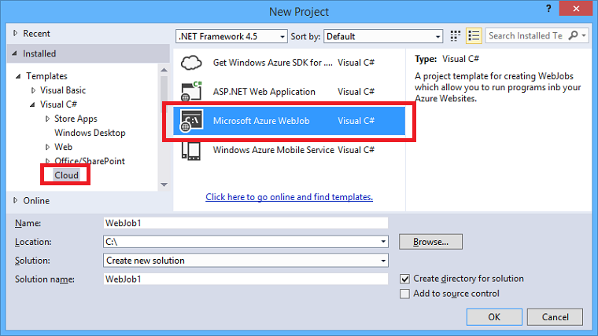
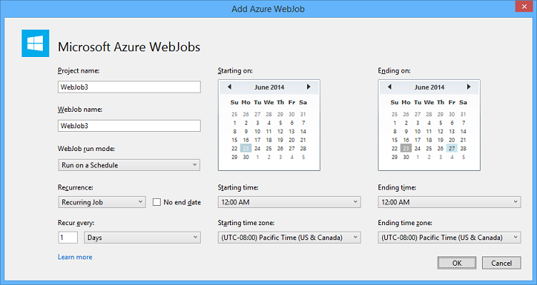

<properties 
	pageTitle="Distribuzione di processi Web usando Visual Studio" 
	description="Informazioni su come distribuire processi Web di Azure in Servizio app per app Web di Azure." 
	services="app-service\web" 
	documentationCenter="" 
	authors="tdykstra" 
	manager="wpickett" 
	editor="jimbe"/>

<tags 
	ms.service="app-service-web" 
	ms.devlang="dotnet" 
	ms.topic="article" 
	ms.tgt_pltfrm="na" 
	ms.workload="web" 
	ms.date="03/24/2015" 
	ms.author="tdykstra"/>

# Distribuzione di processi Web usando Visual Studio

## Informazioni generali

Questo argomento illustra come usare Visual Studio per distribuire un progetto di applicazione console in un'app Web in [Servizio app](http://go.microsoft.com/fwlink/?LinkId=529714) come [Processo Web Azure](http://go.microsoft.com/fwlink/?LinkId=390226). Per informazioni su come distribuire processi Web usando il [portale di Azure](http://go.microsoft.com/fwlink/?LinkId=529715), vedere [Eseguire attività in background con processi Web](web-sites-create-web-jobs.md).

Quando distribuisce un progetto di applicazione console abilitato per i processi Web, Visual Studio esegue due attività:

* Copia i file di runtime nella cartella appropriata nell'app Web (*App_Data/jobs/continuous* per i processi Web in modalità continua,  *App_Data/jobs/triggered* per i processi Web pianificati e su richiesta).
* Configura i [processi dell'utilità di pianificazione di Azure](#scheduler) per i processi Web pianificati per essere eseguiti a orari specifici. Tale operazione non è necessaria per l'esecuzione dei processi Web in modalità continua.

A un progetto abilitato per i processi Web vengono aggiunti gli elementi seguenti:

* Il pacchetto NuGet [Microsoft.Web.WebJobs.Publish](http://www.nuget.org/packages/Microsoft.Web.WebJobs.Publish/).
* Un file [webjob-publish-settings.json](#publishsettings) che contiene le impostazioni di distribuzione e dell'utilità di pianificazione. 

È possibile aggiungere questi elementi a un progetto di applicazione console esistente o usare un modello per creare un nuovo progetto di applicazione console abilitato per i processi Web. 

È possibile distribuire un progetto come processo Web indipendente o collegarlo a un progetto Web in modo tale che venga distribuito automaticamente ogni volta che viene distribuito il progetto Web. Per collegare i progetti, Visual Studio include il nome del progetto abilitato per i processi Web in un file [webjobs-list.json](#webjobslist) nel progetto Web.

 

## Prerequisiti

Le funzionalità di distribuzione dei processi Web sono disponibili in Visual Studio 2013 quando si installa Azure SDK versione 2.4 o versioni successive:

* [Azure SDK per Visual Studio 2013](http://go.microsoft.com/fwlink/p/?linkid=323510&clcid=0x409).

Le funzionalità di distribuzione dei processi Web sono incluse anche in [Visual Studio 2013 Update 3](http://go.microsoft.com/fwlink/?linkid=397827&clcid=0x409) e aggiornamenti successivi.

## Abilitare la distribuzione dei processi Web per un progetto di applicazione console esistente

Sono disponibili due opzioni:

* [Abilitare la distribuzione automatica con un progetto Web](#convertlink).

	Configurare un progetto di applicazione console esistente in modo tale che venga distribuito automaticamente come processo Web quando viene distribuito un progetto Web. Usare questa opzione quando si vuole eseguire il processo Web nella stessa app Web in cui viene eseguita l'applicazione Web correlata.

* [Abilitare la distribuzione senza un progetto Web](#convertnolink).

	Configurare un progetto di applicazione console esistente in modo tale che venga distribuito come processo Web indipendente senza alcun collegamento a un progetto Web. Usare questa opzione quando si vuole eseguire un processo Web in un'app Web in modo indipendente senza l'esecuzione dell'applicazione Web nell'app Web. Questa opzione potrebbe essere utile per scalare le risorse del processo Web indipendentemente dalle risorse dell'applicazione Web.

###  Abilitare la distribuzione automatica dei processi Web con un progetto Web
  
1. Fare clic con il pulsante destro del mouse sul progetto Web in **Esplora soluzioni**, quindi scegliere **Aggiungi** > **Progetto esistente come processo Web Azure**.

	
	
	Viene visualizzata la finestra di dialogo [Aggiungi processo Web Azure](#configure) .

1. Nell'elenco a discesa **Nome progetto** selezionare il progetto di applicazione console da aggiungere come processo Web.

	

2. Completare la finestra di dialogo [Aggiungi processo Web Azure](#configure) , quindi fare clic su **OK**. 

###  Abilitare la distribuzione dei processi Web senza un progetto Web
  	
1. Fare clic con il pulsante destro del mouse sul progetto di applicazione console in **Esplora soluzioni**, quindi scegliere **Pubblica come processo Web Azure**. 

	
	
	Viene visualizzata la finestra di dialogo [Aggiungi processo Web Azure](#configure) con il progetto selezionato nella casella **Nome progetto**.

2.  Completare la finestra di dialogo [Aggiungi processo Web Azure](#configure) , quindi fare clic su **OK**.

	Viene visualizzata la procedura guidata **Pubblica sito Web**.  Se non si vuole eseguire subito la pubblicazione, chiudere la procedura guidata. Le impostazioni immesse vengono salvate in modo da poter essere usate quando si vuole [distribuire il progetto](#deploy).

## Creare un nuovo progetto abilitato per i processi Web

Per creare un nuovo progetto abilitato per i processi Web, è possibile usare il modello del progetto di applicazione console e abilitare la distribuzione dei processi Web come descritto nella [sezione precedente](#convert). In alternativa, è possibile usare il modello nuovo-progetto di processi Web:

* [Usare il modello nuovo-progetto di processi Web per un processo Web indipendente](#createnolink)

	Creare un progetto e configurarlo per essere distribuito in modo indipendente come processo Web senza alcun collegamento a un progetto Web. Usare questa opzione quando si vuole eseguire un processo Web in un'app Web in modo indipendente senza l'esecuzione dell'applicazione Web nell'app Web. Questa opzione potrebbe essere utile per scalare le risorse del processo Web indipendentemente dalle risorse dell'applicazione Web.

* [Usare il modello nuovo-progetto di processi Web per un processo Web collegato a un progetto Web](#createlink)

	Creare un progetto configurato in modo da essere distribuito automaticamente come processo Web quando viene distribuito un progetto Web nella stessa soluzione. Usare questa opzione quando si vuole eseguire il processo Web nella stessa app Web in cui viene eseguita l'applicazione Web correlata.

Nella versione SDK 2.4 il modello nuovo-progetto di processi Web non è molto più facile da usare rispetto alla creazione di un progetto di applicazione console e all'abilitazione della distribuzione dei processi Web. In futuro, il modello nuovo-progetto di processi Web sarà più pratico per lo sviluppo di [WebJobs SDK](http://www.asp.net/aspnet/overview/developing-apps-with-windows-azure/getting-started-with-windows-azure-webjobs), perché installerà automaticamente i pacchetti NuGet appropriati di WebJobs SDK. Fino ad allora, è possibile configurare un progetto in modo da usare WebJobs SDK installando i pacchetti manualmente come illustrato nell'[esercitazione di WebJobs SDK](http://www.asp.net/aspnet/overview/developing-apps-with-windows-azure/getting-started-with-windows-azure-webjobs). 

###  Usare il modello nuovo-progetto di processi Web per un processo Web indipendente
  
1. Fare clic su **File** > **Nuovo progetto**, quindi nella finestra di dialogo **Nuovo progetto** fare clic su **Cloud** > **Processo Web Microsoft Azure**.

	
	
2. Seguire le istruzioni illustrate in precedenza per [rendere il progetto di applicazione console un progetto processi Web indipendente](#convertnolink).

###  Usare il modello nuovo-progetto di processi Web per un processo Web collegato a un progetto Web

1. Fare clic con il pulsante destro del mouse sul progetto Web in **Esplora soluzioni**, quindi fare clic su **Aggiungi** > **Nuovo progetto processo Web Azure**.

	

	Viene visualizzata la finestra di dialogo [Aggiungi processo Web Azure](#configure) .

2. Completare la finestra di dialogo [Aggiungi processo Web Azure](#configure) , quindi fare clic su **OK**.

## Finestra di dialogo Aggiungi processo Web Azure

La finestra di dialogo **Aggiungi processo Web Azure** consente di immettere il nome del processo Web e le impostazioni di pianificazione per il processo Web. 

The fields in this dialog correspond to fields on the **New Job** dialog of the Azure Management Portal. For more information, see [Run Background tasks with WebJobs](web-sites-create-web-jobs.md).

Per un processo Web pianificato (non per i processi Web in modalità continua), Visual Studio crea una raccolta di processi dell'[utilità di pianificazione di Azure](/services/scheduler/), se non ne esiste ancora una, e crea un processo nella raccolta:

* La raccolta di processi dell'utilità di pianificazione viene denominata  *WebJobs-{regionname}*, dove *{regionname}* si riferisce all'area in cui è ospitata l'app Web. Ad esempio: WebJobs-WestUS.
* Il processo dell'utilità di pianificazione viene denominato *{websitename}-{webjobname}*. Ad esempio: MyWebSite-MyWebJob. 
 
>[AZURE.NOTE]
> 
>* Per informazioni sulla distribuzione da riga di comando, vedere [Abilitazione della riga di comando o del recapito continuo di processi Web Azure](/blog/2014/08/18/enabling-command-line-or-continuous-delivery-of-azure-webjobs/).
>* Se si configura un **Processo ricorrente** e si imposta una frequenza di ricorrenza su un numero di minuti, il servizio dell'utilità di pianificazione di Azure non è gratuito. Altre frequenze (ore, giorni e così via) sono gratuite.
>* Se si distribuisce un processo Web e successivamente si modifica la modalità di esecuzione da continua a non continua o viceversa, Visual Studio crea un nuovo processo Web in Azure quando si esegue nuovamente la distribuzione. Se si modificano le altre impostazioni di pianificazione lasciando invariata la modalità di esecuzione o passando dalla modalità pianificata a quella su richiesta o viceversa, Visual Studio aggiorna il processo esistente anziché crearne uno nuovo.

## webjob-publish-settings.json

Quando si configura un'applicazione console per la distribuzione dei processi Web, Visual Studio installa il pacchetto NuGet [Microsoft.Web.WebJobs.Publish](http://www.nuget.org/packages/Microsoft.Web.WebJobs.Publish/) 
e archivia le informazioni di pianificazione in un file  *webjob-publish-settings.json* nella cartella  *Properties* del progetto processi Web. Di seguito è riportato un esempio di tale file:

		{
		  "$schema": "http://schemastore.org/schemas/json/webjob-publish-settings.json",
		  "webJobName": "WebJob1",
		  "startTime": "2014-06-23T00:00:00-08:00",
		  "endTime": "2014-06-27T00:00:00-08:00",
		  "jobRecurrenceFrequency": "Minute",
		  "interval": 5,
		  "runMode": "Scheduled"
		}

È possibile modificare questo file direttamente e Visual Studio fornisce IntelliSense. Lo schema del file viene archiviato in [http://schemastore.org](http://schemastore.org/schemas/json/webjob-publish-settings.json) da dove può essere visualizzato.  

>[AZURE.NOTE]
>
>* Se si configura un **Processo ricorrente** e si imposta una frequenza di ricorrenza su un numero di minuti, il servizio dell'utilità di pianificazione di Azure non è gratuito. Altre frequenze (ore, giorni e così via) sono gratuite.

## webjobs-list.json

Quando si collega un progetto abilitato per i processi Web in un progetto Web, Visual Studio archivia il nome del progetto processi Web in un file  *webjobs-list.json* nella cartella  *Properties* del progetto Web. L'elenco può contenere più progetti processi Web, come illustrato nell'esempio seguente:

		{
		  "$schema": "http://schemastore.org/schemas/json/webjobs-list.json",
		  "WebJobs": [
		    {
		      "filePath": "../ConsoleApplication1/ConsoleApplication1.csproj"
		    },
		    {
		      "filePath": "../WebJob1/WebJob1.csproj"
		    }
		  ]
		}

È possibile modificare questo file direttamente e Visual Studio fornisce IntelliSense. Lo schema del file viene archiviato in [http://schemastore.org](http://schemastore.org/schemas/json/webjobs-list.json) da dove può essere visualizzato.
  
## Distribuire un progetto processi Web

Un progetto processi Web collegato a un progetto Web viene distribuito automaticamente con il progetto Web. Per informazioni sulla distribuzione dei progetti Web, vedere [Come distribuire su App Web](web-sites-deploy.md).

Per distribuire un progetto processi Web indipendente, fare clic con il pulsante destro del mouse sul progetto in **Esplora soluzioni** e scegliere **Pubblica come processo Web Azure**. 

	
Per un processo Web indipendente viene visualizzata la stessa procedura guidata **Pubblica sito Web** usata per i progetti Web, ma con meno impostazioni disponibili da modificare.

>[AZURE.NOTE] Per iniziare a usare il servizio app di Azure prima di registrare un account di Azure, andare a [Prova il servizio app](http://go.microsoft.com/fwlink/?LinkId=523751) dove è possibile creare immediatamente un'app Web di base e temporanea nel servizio app. Non è necessario fornire una carta di credito né impegnarsi in alcun modo.

## Passaggi successivi

Per altre informazioni su come distribuire i processi Web Azure da Visual Studio e con un processo di recapito continuo, vedere [Processi Web Azure - Risorse consigliate - Distribuzione](http://www.asp.net/aspnet/overview/developing-apps-with-windows-azure/azure-webjobs-recommended-resources#deploying).

## Modifiche apportate
* Per una guida relativa al passaggio da Siti Web al servizio app, vedere: [Il servizio app di Azure e il suo impatto sui servizi di Azure esistenti](http://go.microsoft.com/fwlink/?LinkId=529714)
* Per una guida relativa al passaggio dal vecchio al nuovo portale, vedere: [Riferimenti per esplorare il portale di anteprima](http://go.microsoft.com/fwlink/?LinkId=529715)

<!--HONumber=49-->