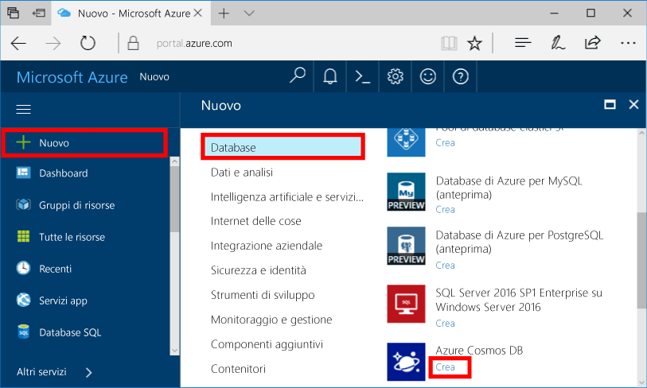

1. In una nuova finestra accedere al [portale di Azure](https://portal.azure.com/).
2. Nel menu a sinistra fare clic su **Crea una risorsa**, quindi su **Database** e infine in **Azure Cosmos DB** fare clic su **Crea**.
   
   

3. Nel riquadro **Nuovo account** specificare la configurazione desiderata per l'account Azure Cosmos DB. 

    Con Azure Cosmos DB è possibile scegliere uno dei quattro modelli di programmazione: Gremlin (graph), MongoDB, SQL e Table (key-value). 
       
    In questa guida introduttiva eseguiremo la programmazione in base all'API MongoDB, per cui occorrerà scegliere **MongoDB** nella compilazione del modulo. Tuttavia, se si dispone di dati grafo per un'app social media, dati documento di un'app di catalogo o dati chiave-valore (tabella), tenere presente che Azure Cosmos DB può fornire una piattaforma di servizi di database distribuiti a livello globale e a disponibilità elevata per tutte le applicazioni cruciali.

    Compilare il riquadro **Nuovo account** usando le informazioni riportate nella tabella come guida.
 
    
   
    Impostazione|Valore consigliato|DESCRIZIONE
    ---|---|---
    ID|*Valore univoco*|Nome univoco scelto per identificare l'account Azure Cosmos DB. Poiché alI'ID fornito viene aggiunto *documents.azure.com* per creare l'URI, usare un ID univoco ma facilmente identificabile. L'ID può contenere solo lettere minuscole, numeri e il carattere '-' e deve avere una lunghezza compresa tra 3 e 50 caratteri.
    API|MongoDB|L'API determina il tipo di account da creare. Azure Cosmos DB offre cinque API per soddisfare le esigenze dell'applicazione, ovvero SQL (database di documenti) Gremlin (grafo), MongoDB, SQL (database di documenti), Tabella di Azure e Cassandra, per ognuna delle quali è attualmente necessario un account separato.   Selezionare **MongoDB** perché in questa guida introduttiva si crea un database di documenti su cui è possibile eseguire query usando MongoDB.  [Altre informazioni sull'API MongoDB](../articles/cosmos-db/mongodb-introduction.md)|
    Sottoscrizione|*Sottoscrizione in uso*|Sottoscrizione di Azure da usare per l'account Azure Cosmos DB. 
    Gruppo di risorse|*Stesso valore di ID*|Nome del nuovo gruppo di risorse per l'account. Per semplicità si può usare lo stesso nome usato come ID. 
    Località|*Area più vicina ai propri utenti*|Posizione geografica in cui ospitare l'account Azure Cosmos DB. Scegliere la posizione più vicina ai propri utenti per fornire loro l'accesso più rapido possibile ai dati.

4. Fare clic su **Crea** per creare l'account.
5. Sulla barra degli strumenti fare clic su **Notifiche** per monitorare il processo di distribuzione.

    

6.  Al termine della distribuzione aprire il nuovo account dal riquadro Tutte le risorse. 

    
