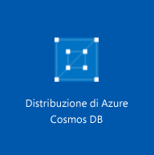

1. In una nuova finestra del browser accedere al [portale di Azure](https://portal.azure.com/).
2. Fare clic su **Nuovo** > **Database** > **Azure Cosmos DB**.
   
   

3. Nella pagina **Nuovo account** immettere le impostazioni per il nuovo account Azure Cosmos DB. 
 
    Impostazione|Valore consigliato|Descrizione
    ---|---|---
    ID|*Immettere un nome univoco*|Immettere un nome univoco per identificare l'account Azure Cosmos DB. Poiché alI'ID fornito viene aggiunto *documents.azure.com* per creare l'URI, usare un ID univoco ma facilmente identificabile.  L'ID può contenere solo lettere minuscole, numeri e il segno meno (-) e deve avere una lunghezza compresa tra 3 e 50 caratteri.
    API|SQL|L'API determina il tipo di account da creare. Azure Cosmos DB offre cinque API per soddisfare le esigenze dell'applicazione, ovvero SQL (database di documenti) Gremlin (grafo), MongoDB, SQL (database di documenti), Tabella di Azure e Cassandra, per ognuna delle quali è attualmente necessario un account separato.   Selezionare **SQL** perché in questo avvio rapido si sta creando un database di documenti su cui è possibile eseguire query tramite la sintassi SQL e a cui è possibile accedere tramite l'API DocumentDB.  [Altre informazioni sull'API di DocumentDB](../articles/cosmos-db/documentdb-introduction.md)|
    Sottoscrizione|*Sottoscrizione in uso*|Selezionare la sottoscrizione di Azure da usare per l'account Azure Cosmos DB. 
    Gruppo di risorse|Creare un nuovo gruppo di risorse  *Immettere quindi lo stesso nome univoco specificato sopra in ID*|Selezionare **Crea nuovo**, quindi immettere il nome di un nuovo gruppo di risorse per l'account. Per semplicità si può usare lo stesso nome usato come ID. 
    Percorso|*Selezionare l'area più vicina agli utenti*|Selezionare la posizione geografica in cui ospitare l'account Azure Cosmos DB. Usare la località più vicina agli utenti per offrire loro la massima velocità di accesso ai dati.
    Abilita ridondanza geografica| Lasciare vuoto | Consente di creare una versione replicata del database in una seconda area abbinata. Lasciare vuoto.  
    Aggiungi al dashboard | Selezionare | Selezionare questa casella per aggiungere il nuovo account di database al dashboard del portale e accedervi più facilmente.

    Fare quindi clic su **Crea**.

    

4. La creazione dell'account richiede alcuni minuti, Durante la creazione dell'account il portale visualizza il riquadro **Deploying Azure Cosmos DB** (Distribuzione di Azure Cosmos DB) a destra, quindi potrebbe essere necessario scorrere a destra del dashboard per visualizzare il riquadro. È presente anche un indicatore di stato nella parte superiore della schermata. È possibile esaminare lo stato di avanzamento nelle due aree. 

    

    Al termine della creazione dell'account verrà visualizzata la pagina **L'account Azure Cosmos DB è stato creato**. 

