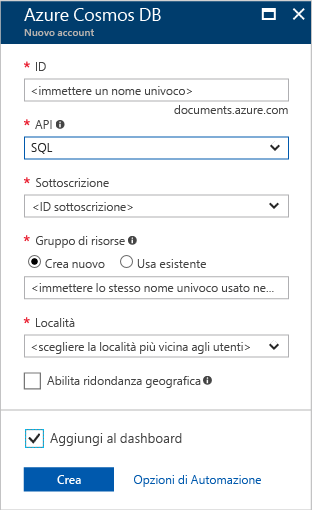

1. In una nuova finestra accedere al [portale di Azure](https://portal.azure.com/).
2. Nel riquadro a sinistra fare clic su **Nuovo**, quindi su **Database** e in **Azure Cosmos DB** fare clic su **Crea**.
   
   

3. Nel pannello **Nuovo account** specificare la configurazione desiderata per l'account Azure Cosmos DB. 

    Con Azure Cosmos DB è possibile scegliere uno dei quattro modelli di programmazione: Gremlin (grafo), MongoDB, SQL (DocumentDB) e Tabella (chiave/valore), ognuno dei quali attualmente richiede un account separato.
    
    In questa guida introduttiva viene eseguita la programmazione in base all'API di DocumentDB, quindi scegliere **SQL (DocumentDB)** quando si compila il modulo. Se si hanno dati di grafi di un'app di social media, dati chiave/valore (tabella) o dati di cui è stata eseguita la migrazione da un'app MongoDB, tenere presente che Azure Cosmos DB può offrire una piattaforma di servizi di database con distribuzione a livello globale e a disponibilità elevata per tutte le applicazioni cruciali.

    Completare i campi nel pannello **Nuovo account** usando le informazioni riportate nello screenshot seguente come guida. I valori effettivi potrebbero essere diversi.
 
    

    Impostazione|Valore consigliato|Descrizione
    ---|---|---
    ID|*Valore univoco*|Nome univoco che identifica l'account Azure Cosmos DB. Poiché alI'ID fornito viene aggiunto *documents.azure.com* per creare l'URI, usare un ID univoco ma facilmente identificabile. L'ID può contenere solo lettere minuscole, numeri e il segno meno (-) e deve avere una lunghezza compresa tra 3 e 50 caratteri.
    API|SQL (DocumentDB)|La programmazione in base all'[API di DocumentDB](../articles/cosmos-db/documentdb-introduction.md) verrà eseguita più avanti in questo articolo.|
    Sottoscrizione|*Sottoscrizione in uso*|Sottoscrizione di Azure da usare per l'account Azure Cosmos DB. 
    Gruppo di risorse|*Stesso valore di ID*|Nome del nuovo gruppo di risorse per l'account. Per semplicità si può usare lo stesso nome usato come ID. 
    Località|*Area più vicina ai propri utenti*|Posizione geografica in cui ospitare l'account Azure Cosmos DB. Scegliere la posizione più vicina agli utenti, per offrire loro l'accesso più rapido possibile ai dati.
4. Fare clic su **Crea** per creare l'account.
5. Nella barra degli strumenti superiore fare clic sull'icona delle **notifiche**  per monitorare il processo di distribuzione.

    

6.  Quando la finestra Notifiche indica che la distribuzione è stata completata, chiudere la finestra di notifica e aprire il nuovo account dal riquadro **Tutte le risorse** nel Dashboard. 

    
 
