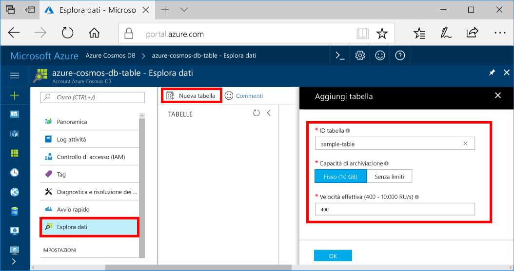

È ora possibile usare Esplora dati per creare una tabella e aggiungere dati al database. 

1. Nel menu di navigazione del portale di Azure fare clic su **Esplora dati (anteprima)**. 
2. Nel pannello Esplora dati fare clic su **Nuova tabella** e quindi compilare i campi della pagina con le informazioni seguenti.

    

    Impostazione|Valore consigliato|Descrizione
    ---|---|---
    ID tabella|sample-table|ID della nuova tabella. I nomi delle tabelle presentano gli stessi requisiti relativi ai caratteri degli ID di database. I nomi dei database devono avere una lunghezza compresa tra 1 e 255 caratteri e non possono contenere `/ \ # ?` o spazi finali.
    Capacità di archiviazione| 10 GB|Lasciare il valore predefinito. Indica la capacità di archiviazione del database.
    Velocità effettiva|400 UR/s|Lasciare il valore predefinito. È possibile aumentare la [velocità effettiva](../articles/cosmos-db/request-units.md) in un secondo momento se si vuole ridurre la latenza.
    UR/min|Off|Usare il valore predefinito.

3. Dopo aver compilato il modulo, fare clic su **OK**.