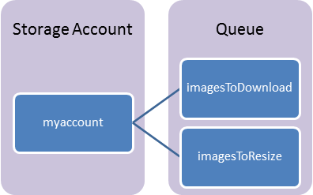

## Informazioni sull'archiviazione di accodamento

Il servizio di archiviazione di accodamento di Azure consente di
archiviare grandi quantità di messaggi ai quali è possibile accedere da
qualsiasi parte del mondo mediante chiamate autenticate tramite HTTP o
HTTPS. La dimensione massima di un singolo messaggio della coda è di 64
KB e una coda può contenere milioni di messaggi, nei limiti della
capacità complessiva di un account di archiviazione. Per gli account di
archiviazione creati dopo l'8 giungo 2012, la capacità totale è pari a
200 TB, mentre per quelli creati precedentemente a tale data, la
capacità totale è di 100 TB. Per informazioni sulla capacità
dell'account di archiviazione, vedere [Obiettivi di scalabilità e
prestazioni per Archiviazione di Azure][1].

Di seguito sono riportati gli utilizzi più comuni per il servizio di
archiviazione di accodamento.

* Creazione di un backlog di lavoro da
  elaborare in modo asincrono
* Recapito dei messaggi da un ruolo Web di Azure a un ruolo di lavoro di
  Azure
## Concetti

Il servizio di accodamento contiene i componenti seguenti:

* **Formato dell'URL:** è possibile fare riferimento alle code
  utilizzando il formato di URL seguente:   
   http://`<storage 
  account>`.queue.core.windows.net/`<queue>`

L'URL seguente fa riferimento a una delle code nel diagramma:  
 http://myaccount.queue.core.windows.net/imagesToDownload

-**Account di archiviazione:** l'accesso ad Archiviazione di Azure
viene eseguito esclusivamente tramite un account di archiviazione. Per
informazioni sulla capacità dell'account di archiviazione, vedere
[Obiettivi di scalabilità e prestazioni per Archiviazione di Azure][1].

* **Coda:** una coda contiene un set di messaggi. Tutti i messaggi
  devono essere inclusi in una coda.

* **Messaggio:** un messaggio, in qualsiasi formato, con dimensione
  massima di 64 KB.

[1]: http://msdn.microsoft.com/en-us/library/dn249410.aspx
