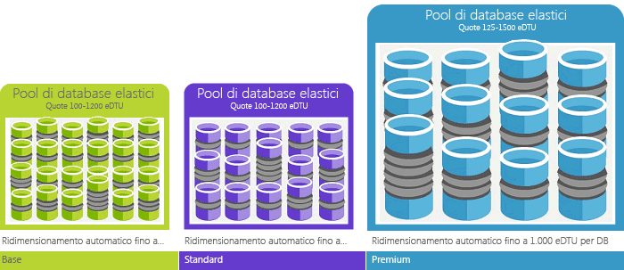

La Database Transaction Unit (DTU) è l’unità di misura nel database SQL che rappresenta la potenza relativa dei database basata su una misura del mondo reale: la transazione del database. Qui si è utilizzata una serie di operazioni che sono tipiche per una richiesta di elaborazione di una transazione in linea (OLTP) e si è quindi misurato il numero di transazioni completate al secondo in condizioni di carico totale (è possibile leggere i dettagli approfonditi in [Panoramica del Benchmark](../articles/sql-database/sql-database-benchmark-overview.md)). 

Ad esempio, un database Premium P11 con 1750 DTU fornisce 350 volte più potenza di calcolo DTU di un database Basic con 5 DTU. 

> [!NOTE]
> Se si esegue la migrazione di un database di SQL Server esistente è possibile usare uno strumento di terze parti per il [calcolo DTU per database SQL di Azure](http://dtucalculator.azurewebsites.net/), per ottenere una stima dei livelli di prestazioni e di servizio che potrebbero essere necessari per il database in database SQL di Azure.
> 
> 

### Confronto tra DTU ed eDTU
Il valore di DTU per singoli database si traduce direttamente in eDTU per i database elastici. Ad esempio, un database in un pool di database elastici Basic offre fino a 5 eDTU. Ovvero la stessa prestazione di un database singolo Basic. La differenza è che il database elastico non utilizzerà eDTU dal pool fino a quando necessario. 

Un semplice esempio: Si prenda in considerazione un pool di database elastici Basic con 1000 DTU ed inserire 800 database in esso. Finché vengono utilizzati solo 200 degli 800 database in qualsiasi momento (5 DTU X 200 = 1000), non si raggiungerà la capacità del pool, e le prestazioni del database non perderanno qualità.. Questo esempio è semplificato per maggiore chiarezza. La matematica reale è un po' più complessa. Il portale esegue i calcoli matematici per l'utente e fornisce un'indicazione in base all'utilizzo cronologico di database. Vedere [Considerazioni su prezzi e prestazioni per un pool di database elastici](../articles/sql-database/sql-database-elastic-pool-guidance.md) per informazioni sulle indicazioni o per eseguire i calcoli matematici. 

<!--HONumber=Jan17_HO3-->

